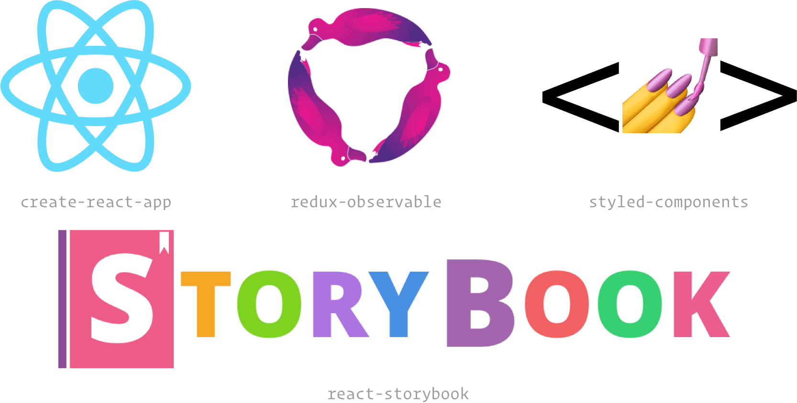
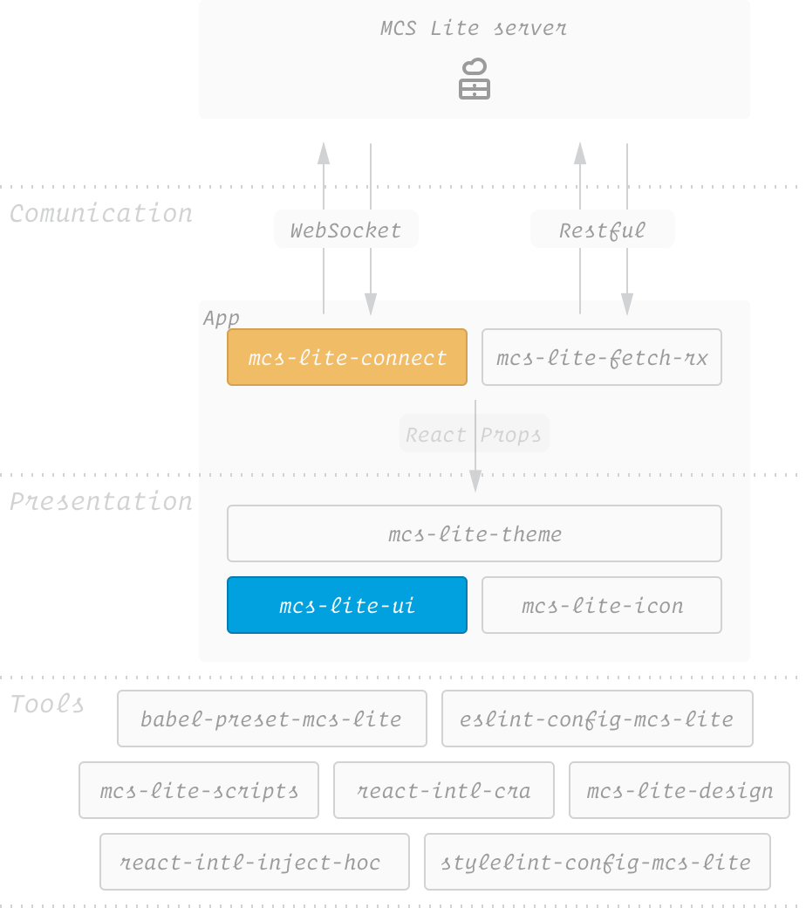
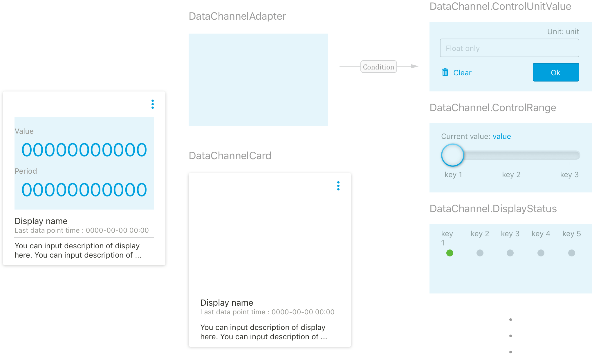
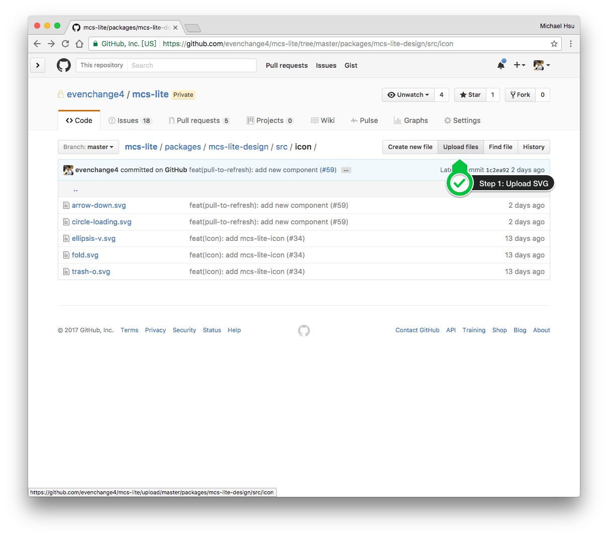
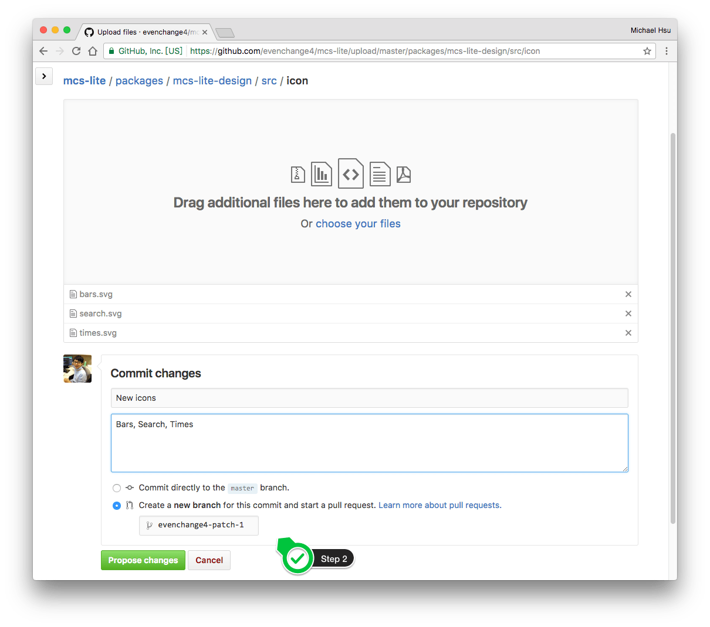
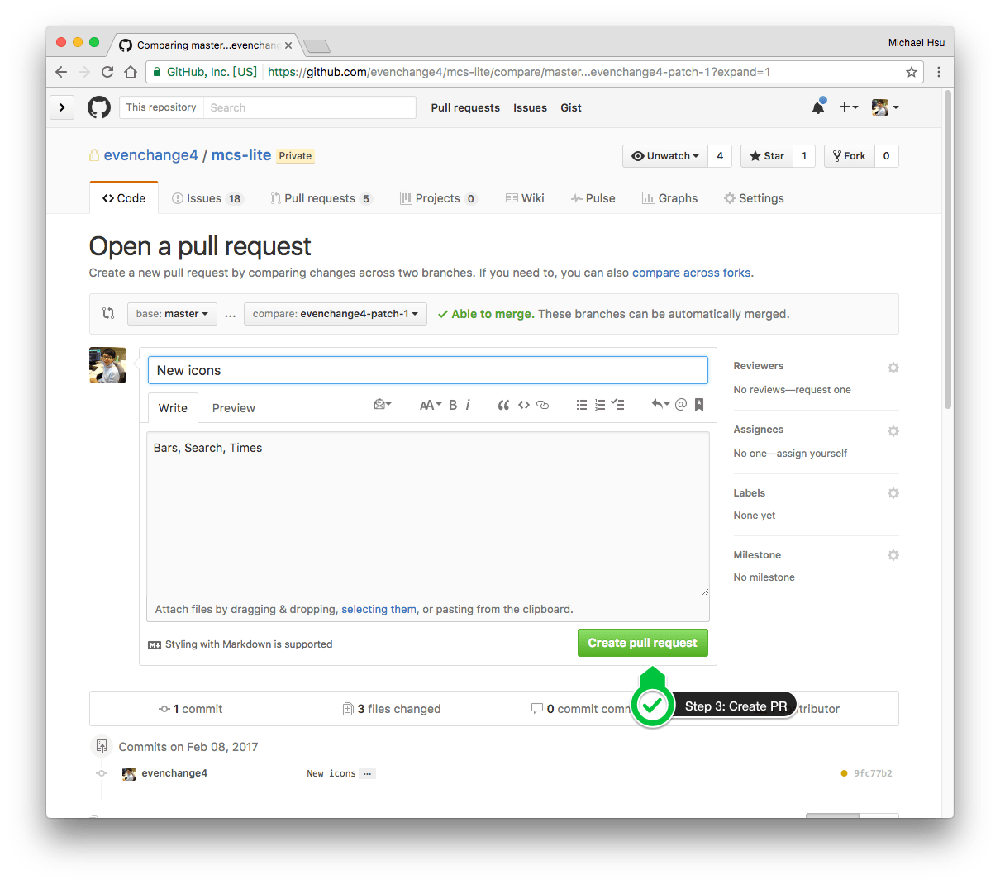
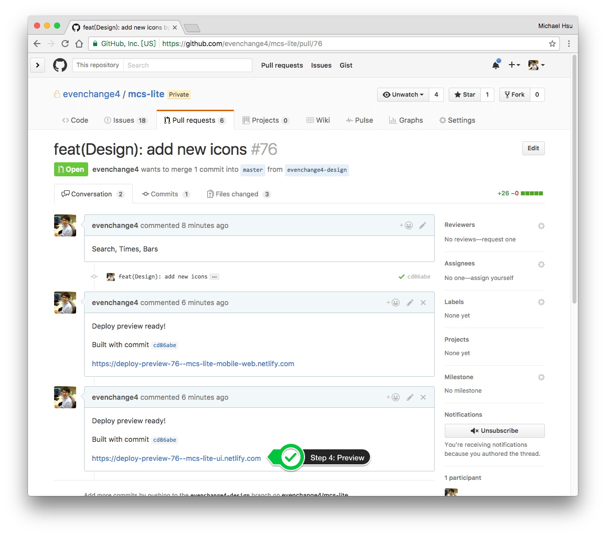
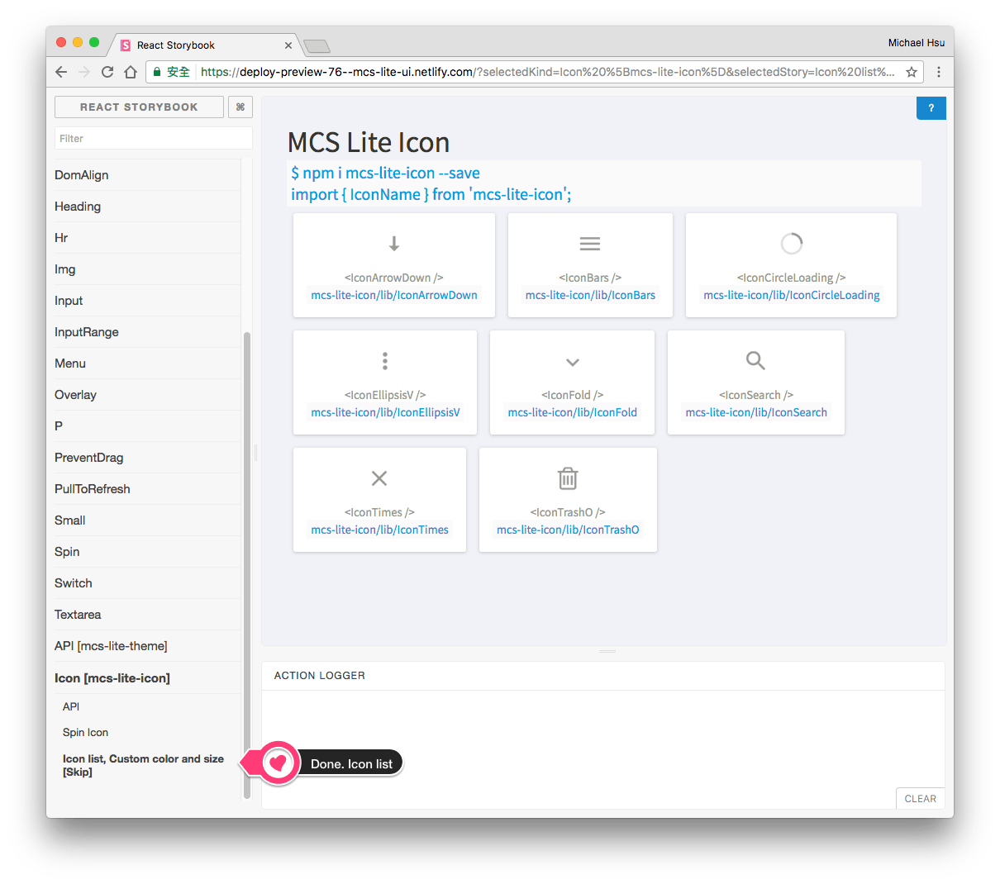

# MCS Lite Developer Guide

## Table of Contents

-   [Release Flow](#release-flow)
-   [Technology Stack](#technology-stack)
-   [Packages Relation](#packages-relation)
-   [DataChannelAdapter Design](#datachanneladapter-design)
-   [How To Add New Icon?](#how-to-add-new-icon)

## Release Flow

1. prerelease
  - `./tasks/build.sh` (Only for dependency packages in order.)
  
2. [lerna publish](https://github.com/lerna/lerna#publish)
  - Version of package.json will be updated.
  - Create git tags.
  - npm `prepack` (Only for projects.)
  - Publish to npm.
 
## Technology Stack

-   [create-react-app](https://github.com/facebookincubator/create-react-app)
-   [react-router](https://github.com/ReactTraining/react-router)
-   [react-helmet](https://github.com/nfl/react-helmet)
-   [react-motion](https://github.com/chenglou/react-motion)
-   [redux](https://github.com/reactjs/redux)
-   [redux-cycles](https://github.com/cyclejs-community/redux-cycles)
-   [styled-components](https://github.com/styled-components/styled-components)
-   [react-storybook](https://github.com/storybooks/react-storybook)
-   [react-intl](https://github.com/yahoo/react-intl)
-   [recompose](https://github.com/acdlite/recompose)

*Further readings: [Build A Web App in MediaTek (中文)](https://medium.com/@evenchange4/build-a-web-app-in-mediatek-61b0a26215a0)*

## Packages Relation

## DataChannelAdapter Design

## How To Add New Icon?

