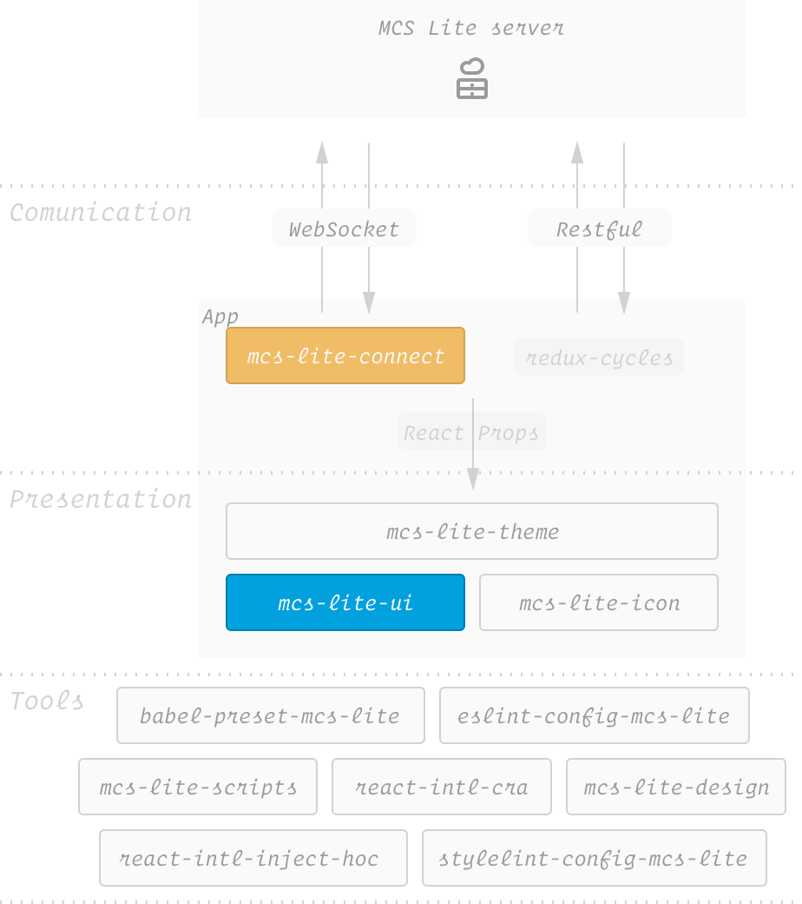

# MCS Lite Developer Guide

## Table of Contents

-   [CI](#ci)
-   [Release Flow](#release-flow)
-   [I18n Workflow](#i18n-workflow)
-   [Technology Stack](#technology-stack)
-   [Packages Relation](#packages-relation)
-   [DataChannelAdapter Design](#datachanneladapter-design)
-   [How To Add New Icon?](#how-to-add-new-icon)

## CI

We use two CIs at same time to separate testing flow.

1. **Travis** (`test.sh`): For unit testing of all packages.
2. **Circle** (`test-page.sh`): For building demo page.

*Note: Required status checks have been enabled to ensure both CI tests are passing.*

## Release Flow

1. prerelease
  - `./tasks/build.sh` (Only for dependency packages in order.)
  
2. [lerna publish](https://github.com/lerna/lerna#publish)
  - Version of package.json will be updated.
  - Create git tags.
  - npm `prepack` (Only for projects.)
  - Publish to npm.
 
## I18n workflow

> Further readings: [I18n Workflow for React Project 中文](https://medium.com/@evenchange4/i18n-workflow-for-react-project-9f9ff8fe9aef)

#### Developer

Extract messages from source code as PO format.

```bash
# packages/mcs-lite-mobile-web

$ yarn run extract:messages
$ yarn run extract:pot
```

If you forget to extract the messages, the [DangerJS checker](https://github.com/MCS-Lite/mcs-lite/blob/master/dangerfile.js#L33) will **FAIL** the build in Travis CI.


#### Translator

Update POT file using [Poedit](https://poedit.net/) editor.

| **Step 1** | **Step 2** | **Step 3** |
|-----|-----|-----|
|  |  |  |

#### Release

The translation file will be generated automatically at **mcs-lite-translation** building phase (`$ npm run build`).

When release, the flow will be:

1.  `npm run release` (lerna)
2.  run `tasks/build.sh` (prerelease)
      - `build` for all packages (mcs-lite-translation)
      - `prepack` for all projects (mcs-lite-\*-web)
3.  NPM publish

## Technology Stack


> Further readings: [Build A Web App in MediaTek (中文)](https://medium.com/@evenchange4/build-a-web-app-in-mediatek-61b0a26215a0)

-   [create-react-app](https://github.com/facebookincubator/create-react-app)
-   [react-router](https://github.com/ReactTraining/react-router)
-   [react-helmet](https://github.com/nfl/react-helmet)
-   [react-motion](https://github.com/chenglou/react-motion)
-   [redux](https://github.com/reactjs/redux)
-   [redux-cycles](https://github.com/cyclejs-community/redux-cycles)
-   [styled-components](https://github.com/styled-components/styled-components)
-   [react-storybook](https://github.com/storybooks/react-storybook)
-   [react-intl](https://github.com/yahoo/react-intl)
-   [recompose](https://github.com/acdlite/recompose)

## Packages Relation



## DataChannelAdapter Design


## How To Add New Icon?

| **Step 1** | **Step 2** | **Step 3** |
|-----|-----|-----|
| | | |

| **Step 4** | **Step 5** |
|-----|-----|
| | |
