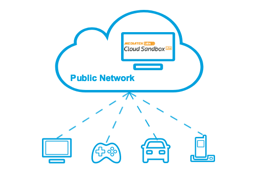
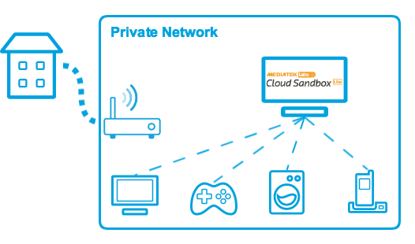
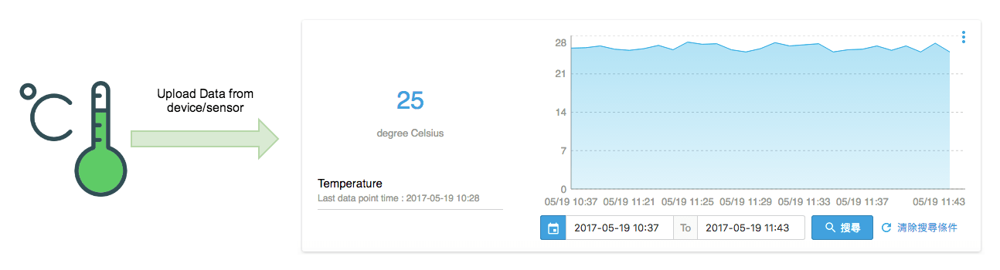
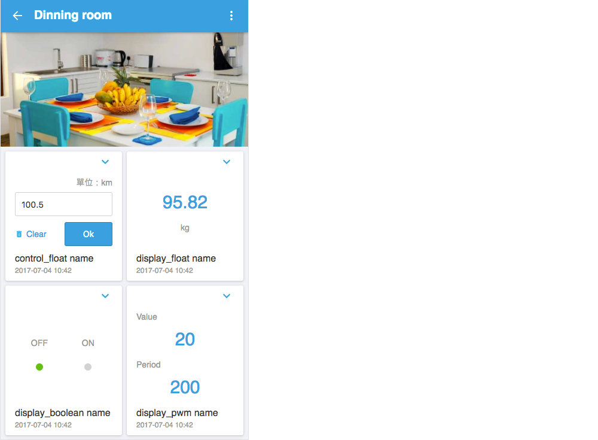

# Introduction

## Features

You can now host your own IoT platform by executing MCS Lite application on your computer and whether it is in an on-premises or on a public network. Every connected devices under the same network can communicate with your IoT platform through HTTP or WebSocket protocol. We will look deeper into the API specification in later chapters.

With MCS Lite, you can build your IoT platform with ease and flexibility, care less about the network latency and the provision of buiding services, but focus more on the innovation and commercializing your IoT products.

|||
|---|---|
|If your computer is on a public network and has a public IP address or hostname, then any devices on the Internet could connect to your MCS Lite IoT platform from worldwide，but you can still have the proprietary of all your data and web Infrastructure.|You can also host a dedicated IoT platform by running MCS Lite in a private network. Only devices on the same network can access to your platform and this could be a way to eliminate your concern about the impact of network latency and the risk of data leakage.|

MCS Lite provides two components and operation consoles. One is **IoT platform** for end users and devices, the other is an **admin console** for platform administrator.

On the IoT platform, there is a web console for end users to create their prototype and define the data channels. On the admin console, administrator can edit the user permission, system configuration, etc. Here are the detailed features:


1. **IoT platform**

   * Upload the data generated by the test device to the MCS Lite through HTTP or WebSocket and visualize the data, including current value and historical data.

	
   
   * Control your test devices from remote through HTTP or WebSocket.

	

   * Define product prototypes and manage all test devices.

   * Provide a friendly user interface for mobile users.
 	

   * Provide the MCS Lite library for LinkIt 7697 to simplify and speed up the development process.

2. **Admin console**

   * Start and stop MCS Lite IoT platform service.
   * Displays the IP and port information currently available for connecting.
   * Set up the configuration of each service.
   * Manage the user account and data of this platform.

## Installation guide
### Get Started on Windows or Mac

1. Download MCS Lite package. [Download now](https://github.com/MCS-Lite/mcs-lite-app/releases)
2. Unzip the downloaded file. The generated folder can be moved or copied to any directory.
3. Double-click on **mcs-lite-app** to launch MCS Lite admin console. Please be noted, the IoT platform is not started at this moment.

   * If you are executing **mcs-lite-app** on MacOS for the first time or if you have changed the file path, be sure to execute the **setup** script to re-initialize config.json file.
   * If you are executing **mcs-lite-app** on MacOS, you may see the following warning window. Please launch MCS Lite from context menu by right-clicking on your mouse.
   	

4. If MCS Lite is launched for the first time, you have to register an administrator account to sign into the admin console. If you cannot see the registration page on MCS Lite App, please go to **http://localhost:3002/admin/signup** directly in the browser. After sign up，you need to sign into admin console again.
	
	
5. Click the **Start** button at top-right corner of the admin console，start running the MCS Lite IoT Platform.
	
	 
6. The **IP Connection** page lists IP address and port that MCS Lite IoT Platform binds.
	
	
7. Enter the IP and port in the browser's address bar to connect to the MCS Lite web console. 
	
   
8. Devices on the same network can also start uploading or receiving data via APIs provided by MCS Lite.

	```
	POST /api/devices/HJZyx1bFQZ/datapoints.csv HTTP/1.1
	Host: localhost:3000
	Connection: keep-alive
	content-type: text/csv
	deviceKey: b90284ea31ea7df19e5b159f66721f1ac14ddb0150275d066ac6eb86e6a5eb20
	Content-Length: 19

	display_integer,,43
	```
	
9. MCS Lite application is still running after you click on "X" to close the Admin Console window. If you want to terminate MCS Lite application competely, please click the MCS Lite icon in the system tray and choose "Quit MCS Lite".
	
	

### Get Started on Linux or LinkIt 7688
1. Node.js v0.12.7 has been pre-installed in LinkIt 7688. If you are using Linux, you need to have Node.js ( >7.3.0) installed on your machine, on which MCS Lite will run，please refer to  [Installing Node.js via package manager](https://nodejs.org/en/download/package-manager/) for detailed instruction.
2. Download MCS Lite package. [Download now](https://github.com/MCS-Lite/mcs-lite-app/releases)
3. Unzip the downloaded file. The generated folder can be moved or copied to any directory.
4. In the terminal console, chnage directory to the decompressed folder and execute the following instructions to run the MCS Lite service in the background.
	```
	node server.js&
	```
5. When you see the following screen, MCS Lite service has been started successfully, and you can open your browser to connect to MCS Lite by the prompt IP address. 

	```
	+-+-+-+ +-+-+-+-+
 	M C S   L I T E 
	+-+-+-+ +-+-+-+-+
 	MCS Lite server IP: 
 	'10.10.10.10:3000'
	```
It is worth noting that the Linux and LinkIt 7688 versions do not support the admin management console, so you don't have to perform the fourth step in "Get started with Windows or Mac" to register the administrator account in advance.


## System requirement

### Operating system

| **Operating system** | **Version** |
| :--- | :--- |
| Windows | Windows 7 and above |
| MacOS | 10.12 Sierra and above |
| Linux | Debian and Ubuntu based Linux distributions, OpenWrt |
| Others | MCS Lite can be installed on other platforms with limited functionality, for detailed informaiton please refer to [Appendix A](/mcs_lite_platform.md)。 |

### Hardware

* 400 MHz or above 32-bit (x86) or 64-bit (x64) processor

* Recommended at least 256 MB of RAM

* 2 GB of available hard disk space

* Network connection

* Allow being accessed through port 3000, 8000, 8888 in firewall rule. (Please refer to [Admin console](/mcs_lite_usage/mcs_lite_admin_usage.md) for mode details)
