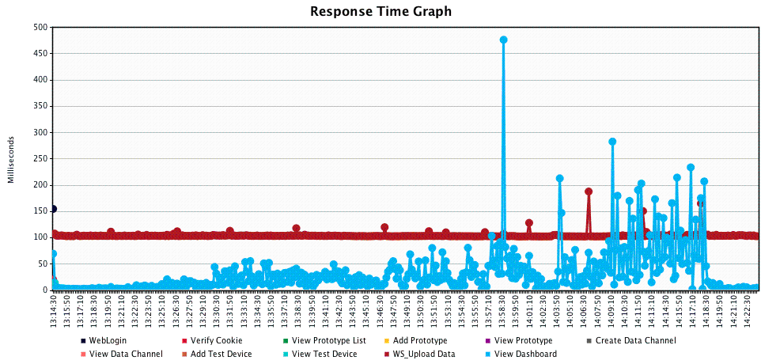

### Appendix B：Performance and capacity test
As the main function of the IoT platform is the collection of data and remote control，So this test scenario mainly through **WebSocket** to upload and download data points。

#### System Spec
| OS | CPU | Memory |
| :--- | :--- | :--- |
|macOS 10.12.4 on MacBook Pro|Processor Name: Intel Core i5  Processor Speed: 2.7 GHz  Number of Processors: 1  Total Number of Cores: 2 |8 GB|

#### Test Scenario
| MCS Lite Server | Thread Number | Duration | Target RPS | 
| :-------------- | :------------ | :-------- | :--------- | 
|localhost| 20 | 1 hour | 200 |

#### Test Result
|Average Throughput| Average Response Time|
|:---|:---|:---|
| 166 req/sec | 99 ms |

In the chart below, it shows that MCS Lite server can handle about 150 to 200 requests per second，but the longer the system is running，the longer it takes for the RESTful server to respond，although there is no obvious change in the response time of  WebSocket server. 

It is because we adopt NeDB in MCS Lite package, and the data in NeDB will be fully loaded into the memory while the application is up, so when the amount of data is growing, the program's performance is also getting slower.

We recommend you to keep each file of your NeDB at **100 MB** or lower to have better server performance if you have the equivalent hardware specification.

##### Transaction per second

##### Response time

#### Memory usage

#### CPU usage
