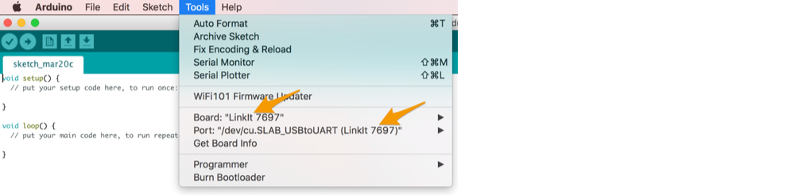
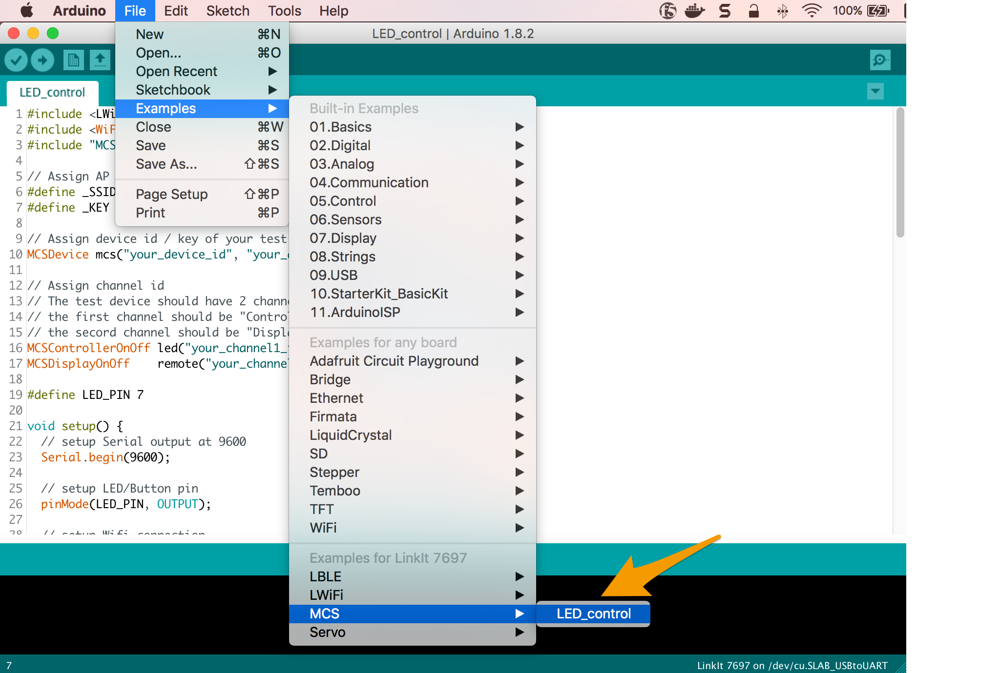
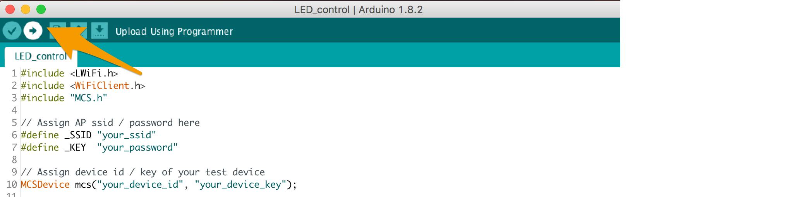
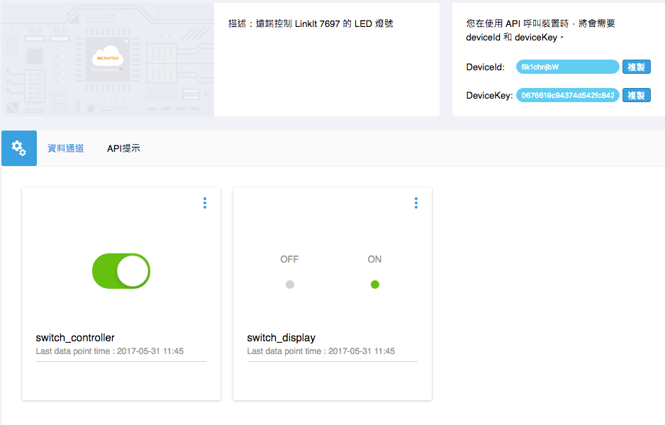

# Arduino - Tutorials
## Control LED light remotely

We will use LinkIt 7697 Arduino to communicate with the MCS Lite server. Using the MCS Lite switch data channel to turn on and off the LED light on LinkIt 7697 development board and then uploading the current status of the USR LED to another data channel.

Here, we provide two different implementations. One is using the MCS library, implement the connection and interaction with the MCS Lite server by calling wrapped APIs.

If you want a more in-depth understanding of the design and architecture of MCS Lite, you can also refer to the second example to implement the MCS Lite WebSocket and RESTful APIs connection from scratch.

### 1. Using MCS library

MCS Library is included in the Arduino board support package of LinkIt 7697. You can use this library to implement your test device and its interaction between MCS or MCS Lite servers. It is relatively easy to get started with. MCS library provides following functionality:

* Connect to the specified MCS or MCS Lite server.
* Establish a data channel.
* Upload data to MCS or MCS Lite server.
* Retrieve data from MCS or MCS Lite servers.

If you are connecting to the MCS Lite platform, you can use the **MCSLiteDevice** class to construct your connection information.

```cpp
MCSLiteDevice(const String& device_id, const String& device_key, const String& server, int port);
```

* **device_id**: The ID of the test device created on MCS Lite
* **device_key**: The key of the test device created on MCS Lite
* **server**: The network address of the server running MCS Lite. It can be IP or hostname.
* **port**: The port used by RESTful APIs. It is 3000 by default.

For a more detailed introduction to the MCS library, please refer to [Labs resources](https://docs.labs.mediatek.com/resource/linkit7697-arduino/en/using-mcs-library)。


Now, let's get your LinkIt 7697 connected to MCS Lite by using MCS Library and start to control your device from MCS Lite web console.

#### Prerequisite

1. Set up the Arduino IDE development environment for LinkIt 7697, please refer to the detailed steps on [Labs resources](https://docs.labs.mediatek.com/resource/linkit7697-arduino/en/setup-arduino-ide-for-linkit-7697).
2. Connect LinkIt 7697 to your computer, please refer to the detailed steps on [Labs resources](https://docs.labs.mediatek.com/resource/linkit7697-arduino/en/connecting-linkit-7697-to-computer)。
3. Launch MCS Lite Application, open the browser to MCS Lite web console, create a prototype, define the data channel and add a test device. The data channels used in this example are:

	* ON/OFF Controller: Data channel ID is **switch_controller**
	* ON/OFF Display: Data channel ID is **switch_display**

	On the MCS Lite web console, you can manually create or import the prototype directly.[Download prototype JSON file](https://github.com/MCS-Lite/mcs-lite-example/blob/master/LinkIt_7697/Arduino/mcs-lite-prototype-led-example.json)
	
	If you change the data channel ID, remember to change the ID and variables in the code.

#### Use the built-in MCS> LED_control example
1. Open Arduino IDE, in the menu Tools > Board, select **LinkIt 7697**. In the menu Tools > Port, select the serial port that LinkIt 7697 is connected and there is **(LinkIt 7697)** in suffix. 
	

2. Select File > Examples > MCS > LED_control open the MCS example.
	

3. Modify the variables in the code according to your network environment and MCS Lite settings.
	* First, modify the WiFi connection settings
	
	```arduino
	// Assign AP ssid/password here
	#define _SSID "your_ssid"
	#define _KEY  "your_password"
	``` 
	
	* Second, modify **MCSDevice** to **MCSLiteDevice** and enter the actual Device ID, Device Key and MCS Lite server connection information in the constructor, for example
	
	```arduino
	// Assign device id/key of your test device
	// MCSDevice mcs("your_device_id", "your_device_key");
	MCSLiteDevice mcs("Drcsun...", "YGsl0go...", "192.169.1.100", 3000);
	```
	
	* Replace the Data channel ID to the one previously created on the MCS Lite web page, for example
	
	```arduino
	// Assign data channel ID
	MCSControllerOnOff led("switch_controller");
	MCSDisplayOnOff    remote("switch_display");
	```
4. After the modification is complete, click the **Upload** button on the Arduino IDE to compile and upload the code to the LinkIt 7697 development board.	

5. Once the upload is complete, open your browser to the MCS Lite test device details page, operate the ON/OFF type controller on the MCS Lite web console.  When the controller is switched to **on** state, **USR LED** will light up on the LinkIt 7697 development board, and then upload the "ON" state (Boolean value 1) to the display data channel; Vise versa, the LED will be turned off and upload the OFF state (Boolean value 0).

	**MCS Lite test device detailed page** 
	
	**LinkIt 7697 USR LED light** 
	
	
### 2. Implement your own connection to MCS Lite's by using WebSocket and RESTful APIs
Compared to the last example, using MCS library, this one is relatively complex. You have to parse the received data one by one in your code, so it is recommended that users could use MCS library directly while developing MCS or MCS Lite related project if the library is available on that development board, such as LinkIt 7697. This example can be used as a reference for development on devices that have not yet provided an MCS library.

#### Prerequisite

1. Set up the Arduino IDE development environment for LinkIt 7697, please refer to the detailed steps on [Labs resources](https://docs.labs.mediatek.com/resource/linkit7697-arduino/en/setup-arduino-ide-for-linkit-7697).
2. Connect LinkIt 7697 to your computer, please refer to the detailed steps on [Labs resources](https://docs.labs.mediatek.com/resource/linkit7697-arduino/en/connecting-linkit-7697-to-computer)。
3. Launch MCS Lite Application, open the browser to MCS Lite web console, create a prototype, define the data channel and add a test device. The data channels used in this example are:

	* ON/OFF Controller: Data channel ID is **switch_controller**
	* ON/OFF Display: Data channel ID is **switch_display**

	On the MCS Lite web console, you can manually create or import the prototype directly.[Download prototype JSON file](https://github.com/MCS-Lite/mcs-lite-example/blob/master/LinkIt_7697/Arduino/mcs-lite-prototype-led-example.json)
	
	If you change the data channel ID, remember to change the ID and variables in the code.

#### Use LED Blink example

1. Open Arduino IDE, in the menu Tools > Board, select **LinkIt 7697**. In the menu Tools > Port, select the serial port that LinkIt 7697 is connected and there is **(LinkIt 7697)** in suffix. 
	

2. Copy the source code of [LED Blink Example](https://github.com/MCS-Lite/mcs-lite-example/blob/master/LinkIt_7697/Arduino/LED_controller.ino) to your Arduino IDE, and modify the variables in the code according to your network environment and MCS Lite settings, for example

	```arduino
	char ssid[] = "mcs";  
	char pass[] = "mcs123";  
	char deviceId[] = "HydTsgYie";  
	char deviceKey[] = 	"96e2478320088f10242360c768fce82faf119fd38524afc8c461e5da9b20300c";  
	char server[] = "192.168.1.241";  
	int ws_port = 8000;  
	int rs_port = 3000
	```
	
	* **ssid**: The name of the wireless network to be connected
	* **pass**: The password of the wireless network to be connected
	* **device ID**: The ID of the test device created on the MCS Lite
	* **device Key**: The key of the test device created on the MCS Lite
	* **server**: The network address of the server running by MCS Lite. It can be either IP or host name.
	* **ws_port**: Port used by WebSocket server, the default value is 8000
	* **rs_port**: Port used by RESTful server, the default value is 3000

3. After the modification is complete, click the **Upload** button on the Arduino IDE to compile and upload the code to the LinkIt 7697 development board.	

4. Once the upload is complete, open your browser to the MCS Lite test device details page, operate the ON/OFF type controller on the MCS Lite web console.  When the controller is switched to **on** state, **USR LED** will light up on the LinkIt 7697 development board, and then upload the "ON" state (Boolean value 1) to the display data channel; Vise versa, the LED will be turned off and upload the OFF state (Boolean value 0).

	**MCS Lite test device detailed page** 
	
	**LinkIt 7697 USR LED Light** 

#### Code explanation

In this example, we set up a WebSocket connection with the MCS Lite server to receive the commands sent from the server. The connection of WebSocket is permanent, once established, it will periodically send heartbeat to inform the server that this device is still alive and remains connected.

**call connectWs() in setup() to establishe WebSocket connection**

```arduino
void setup() {
	...
	// compose WebSocket request packet
  	request += "GET /deviceId/";
	...
  	request += "\r\nOrigin: null\r\n\r\n";
  	// call WebSocket connection method
  	connectWs();
}
void connectWs () {
	if (ws_client.connect(server, ws_port)) {
		Serial.println("connected to ws_server");
		...
       }
}
```

**In loop(), send heartbeat to MCS Lite server and receive the commands sent from the server**

```arduino
void loop() {
	...
	//When the WebSocket connection is established, send a heartbeat packet every 10 seconds
  	while (ws_client.available()) {
     	if(lastTime == 0) {
        	lastTime = millis();
      	} else {
        	int thisTime = millis();
        	if(thisTime - lastTime > 10 * 1000) {
          	unsigned char frame;
          	frame = 0x01; // FIN
          	frame = (0x01 << 4);
          	ws_client.print(frame);
          	lastTime = millis();
       	 }
      }
     
      //Read the data sent by the MCS Lite server
      int v = ws_client.read();
     
      if (v != -1) {
        	wscmd += (char)v;  
        	//Compare the string, when the received string equals to the previously defined switch_on string, turn on USR LED. USR LED is the P7 on LinkIt 7697 
        	if (wscmd.substring(2).equals(switch_on)){
          	digitalWrite(7, HIGH);
          	String data = "string_display,,LED is ON";
          	upload_datapoint(data);
          	wscmd = "";
          //Compare the string, when the received string equals to the previously defined switch_off string, turn off USR LED. USR LED is the P7 on LinkIt 7697 
        	} else if (wscmd.substring(2).equals(switch_off)){
          	digitalWrite(7, LOW);
          	String data = "string_display,,LED is OFF";
          	upload_datapoint(data);
          	wscmd = "";
        		}
      	}
  	}
	...
}
```
In the example above, we simply take the string alignment to determine the ON and OFF commands, you can further through the JSON parser to handle the received JSON data.

When processing the received data from WebSocket, We also call the **upload_datapoint ()** function at the same time to upload a string to the MCS Lite server via the RESTful API. Where **string_display** is the data channel ID we defined earlier.

```arduino
if (wscmd.substring(2).equals(switch_on)){
	digitalWrite(7, HIGH);
	String data = "string_display,,LED is ON";
   	upload_datapoint(data);
	wscmd = "";
} else if (wscmd.substring(2).equals(switch_off)){
	digitalWrite(7, LOW);
   	String data = "string_display,,LED is OFF";
   	upload_datapoint(data);
	wscmd = "";
}
```

```arduino
void upload_datapoint(String content) {
	if (rs_client.connect(server, rs_port)) {
    	Serial.println("rs_client is built.");
    	int thislength = content.length();
    	rs_client.print("POST /api/devices/");
    	...
    	rs_client.println(); 
   		while(!rs_client.available())
    	{
      		delay(10);
    	}
  	}
  	Serial.println("rs_client is closed.");
  	rs_client.stop();
}
```