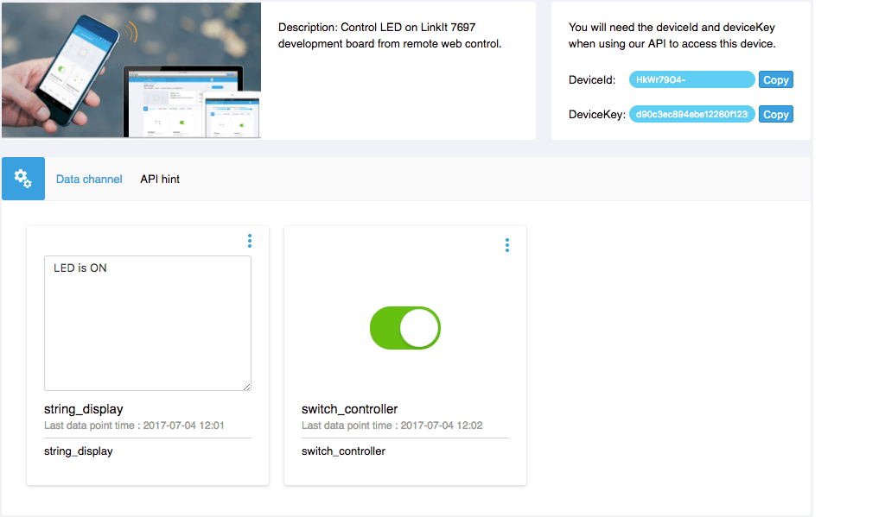

# LinkIt SDK - Tutorials
## Control LED light remotely

We will implement on the LinkIt 7697 SDK GCC development environment in this example and use the MCS Lite switch data channel to turn on and off the LED light on LinkIt 7697 development board and then upload the current status of the USR LED to another data channel.

### Prerequisite

1. Set up LinkIt 7697 GCC ARM Embedded development environment, please refer to the detailed steps on [Labs resources](https://docs.labs.mediatek.com/resource/mt7687-mt7697/en/get-started-linkit-7697-hdk/gcc-arm-embedded-linkit-7697)。
2. Connect LinkIt 7697 to your computer, please refer to the detailed steps on [Labs resources](https://docs.labs.mediatek.com/resource/mt7687-mt7697/en/get-started-linkit-7697-hdk/gcc-arm-embedded-linkit-7697/connect-linkit-7697-to-computer)。
3. Launch MCS Lite Application, open the browser to MCS Lite web console, create a prototype, define the data channel and add a test device. The data channels used in this example are:

	* ON/OFF Controller: Data channel ID is **switch_controller**
	* ON/OFF Display: Data channel ID is **switch_display**

	On the MCS Lite web console, you can manually create or import the prototype directly.[Download prototype JSON file](https://github.com/MCS-Lite/mcs-lite-example/blob/master/LinkIt_7697/Arduino/mcs-lite-prototype-led-example.json)
	
	If you change the data channel ID, remember to change the ID and variables in the code.

### Use LED Blink example

1. Download [LED Blink Example](https://github.com/MCS-Lite/mcs-lite-example/tree/master/LinkIt_7697/GCC/LED_controller) and place **LED\_controller** folder to **{SDK\_root}/project/linkit7697\_hdk/apps** directory.
2. Modify **LED\_controller/src/main.c** file, configure the network settings of development borad and MCS Lite connection information, for example
		
	```arduino
	// Input your Wi-Fi setting here 
	#define SSID "mcs"
	#define PASSWORD "mcs1234"
	
	//Input MCS Lite websocket server here
	#define WEBSOCKET_SERVER "192.168.1.241"
	#define WEBSOCKET_PORT 8000
	
	//Input MCS Lite RESTful server here
	#define API_SERVER "192.168.1.241"
	#define API_PORT 3000
	
	// Input MCS Lite device ID and Key here
	#define DEVICE_ID "Bk1chnjbW"
	#define DEVICE_KEY "0676619c94374d542fc8421d0ed73ad3e189c03459453c214a8276cb26c341db"
	```

	* **SSID**: The SSID of your Wi-Fi AP 
	* **PASSWORD**: The password of your Wi-Fi AP 
	* **WEBSOCKET_SERVER**: The network address of the WebSocket server that is running MCS Lite. It can be either an IP or a host name
	* **WEBSOCKET_PORT**: The port of the WebSocket server that is running MCS Lite.The default value is 8000
	* **API_SERVER**: The network address of the RESTful server that is running MCS Lite. It can be either an IP or a host name
	* **API_PORT**: The port of the RESTful server that is running MCS Lite.The default value is 3000
	* **DEVICE_ID**: The ID of the test device created on MCS Lite
	* **DEVICE_KEY**: The key of the test device created on MCS Lite
 
3. Then you can start compiling and building your project by using GCC. After the modified code has been saved, switch to the **GCC** folder and execute the **make** command.
	
	```bash
	cd {SDK_Root}/project/linkit7697_hdk/apps/my_project/GCC
	make
	```
	or switch to **{SDK\_Root}** folder and execute **.\\build.sh** script.
	
	```bash
	cd {SDK_Root}
	./build.sh linkit7697_hdk LED_controller
	```
	
4. The compiled binary file will be placed at **{SDK\_root}/project/linkit7697\_hdk/apps/LED_controller/GCC/Build** folder. At this point, you can use the SDK's **Flash Tool** to download the compiled binary file to the development board. please refer to the detailed steps on [Labs resources](https://docs.labs.mediatek.com/resource/mt7687-mt7697/en/get-started-linkit-7697-hdk/gcc-arm-embedded-linkit-7697/download-project-binary-with-flash-tool-linkit-7697)。

5. When the download is complete, switch the screen to your browser and open the MCS Lite test device detailed page. When the controller is switched to **on** state, **USR LED** will light up on the LinkIt 7697 development board and then upload **LED is ON** string to a string display data channel；Vise versa, the LED will be turned off and upload the **LED is ON** string.

	**MCS Lite test device detailed page** 
	
	**LinkIt 7697 USR LED light** 
	
### Code explanation
Let's look at the **main.c** file. We will establish a WebSocket connection to the MCS Lite server after the device's connects to Wi-Fi for receive data from the server side. The received data will be processed in **tcp\_callback()**. WebSocket connection is permanent, once established, will periodically send heartbeat to inform the server that this device is still alive and remains connected.


In **tcp\_callback()**, We used cJSON library to parse the data from MCS Lite to determine the ON and OFF commands.

At the same time, in the process of receiving WebSocket data, we also call **mcs\_upload\_datapoint()** to upload a string to MCS Lite server by using RESTful API. **string_display** is the data channel ID we defined previously.
