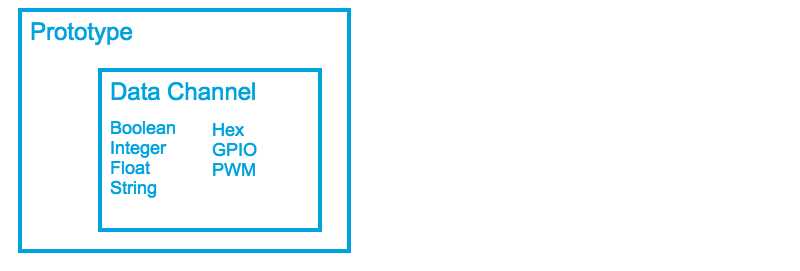
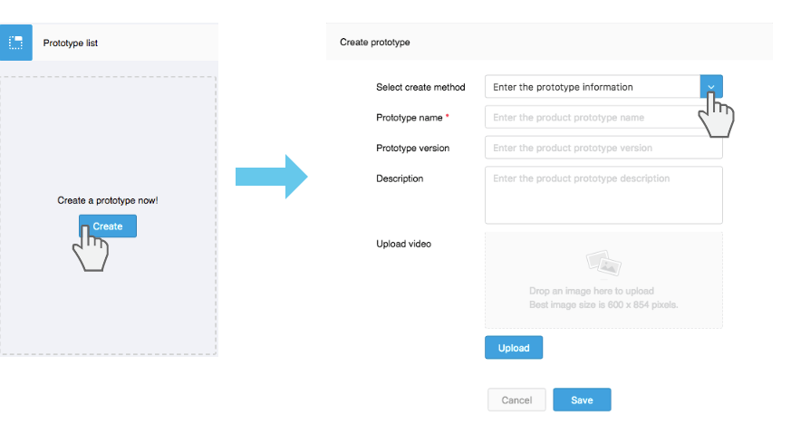
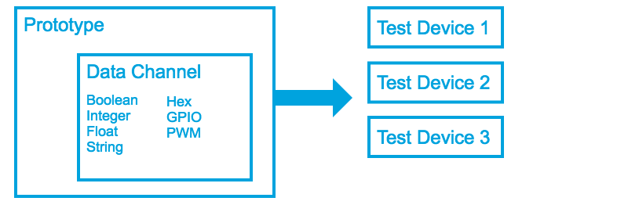
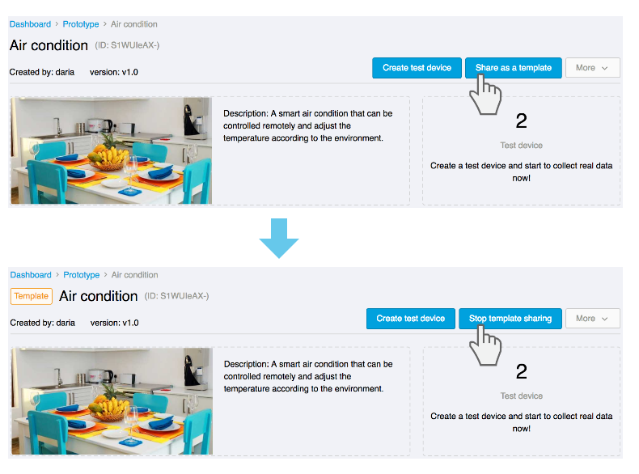

# IoT platform instructions

If you have already used the MediaTek Cloud Sandbox (MCS) service, you should be familiar with the MCS Lite interface. You only need to enter the IP address and port bound by MCS Lite in the address bar of the browser to connect to the local MCS Lite platform. For information about MCS Lite's connection, please contact your system administrator.

MCS Lite provides the same features as MCS. Users can define their own prototypes and management test devices on the web console, and then the physical device can then call the web APIs provided by MCS Lite to upload and retrieve data. If you have not used the MCS before, you can learn how to set up a test device on MCS Lite, retrieve data and implement remote control by going through the following terminologies.

## Prototype

### What is prototype?

A prototype is a blueprint for your product design. It mainly defined the data channels that your physical devices would like to communicate with the MCS Lite server.

#### **Data Channel**

A data channel represents the following:

1. Data generated by a component of a device that will be stored in MCS Lite or

2. A command that can be sent from the MCS Lite to the device.

There are 2 different types of data channels.

* **Display**：This type is used to store and display the data generated from a device component. 

* **Controller**：This type is for data generated in the MCS Lite and sent to the device to control the setting of a logical or physical component in the device. 

MCS Lite can display and process the data according to their data type. Here are the data types that MCS Lite supports:

* **Boolean switch**:  Use a switch to represent the active or deactive state.

* **Integer**: This data type represents an arbitrary integer, such as the number of steps a user has taken.

* **Float**: This data type represents an arbitrary floating point number, such as the temperature.

* **String**: This data type represents a string, such as a message issued by the device.

* **Hex**: This data type represents a hexadecimal value, such as the color used in an LED display.

* **GPIO**: This data type represents a digital signal for a specific GPIO pin, such as HIGH on Pin 4.

* **PWM**: This data type represents a PWM signal delivered to a specific GPIO pin, such as level 15 on Pin 3.

### How to create a prototype?

In the navigation header, select **Development** > **Prototype**, and then click on the **Create** button. In the prototype creation dialog, you are allowed to create prototype in following 3 different methods:

* Make your own from scratch
  1. Click the **Development** option on the navigation bar, select **Prototype**.
  2. Click **Create** button, in **Select creation method** field, select **Enter prototype information**.
  3. Enter the product prototype name and version and click the **Save** button. Your prototype has been created.
* Import JSON file 
  1. Click the **Development** option on the navigation bar, select **Prototype**. 
  2. Click **Create** button, in **Select creation method** field, select **Import from JSON file**.
  3. You can either copy the JSON content or **Browse and upload** a JSON file. Click the **Save** button. Your prototype has been created.
  4. How to export the JSON file of a prototype, please refer to [Create Your First Prototype](https://mcs.mediatek.com/resources/latest/tutorial/getting_started#create-your-first-prototype)

* Start with a template
  1. Click the **Development** option on the navigation bar, select **Prototype**.
  2. Click **Create** button, in **Select creation method** field, select **Start with a template**.
  3. The templated created by system admin will be listed in **Select template** dropdown menu. Please select one.
  4. The data channels of selected template will be created as well.

When the prototype is created, click on the **details** button to start creating the data channels and adding the test devices.

## Test device

### What is a test device?

 In conceptual, similarly to what the prototype is to the blueprint of product, a test device is a physical device your application is running on.

Before you start collecting data or control physical devices from MCS Lite, you must create a corresponding test device under that prototype. Each test device will have a set of **DeviceId** and **DeviceKey**, which are needed when calling MCS API to access the test device on MCS Lite.

Go to **Prototype** details> **Test devices** tab, you can view all the test devices under this prototype, or select a specific test device to view the data collected or perform remote control. You can also edit or view detailed information about this device.

### How to create a test device?

#### Step 1: Create a test device on MCS Lite

1. Go to prototype detailed page.
2. Click **Create test device** button on the top right of the screen.
3. In the create test device dialog box, enter the test device name and description, and then click the **OK** button.
4. The test device is created and you can view the device information on device detailed page now.

#### Step 2: Set up the connection of the physical device to MCS Lite

Currently MCS Lite mainly supports WebSocket and HTTP protocols and provides several web APIs to connect the physical device to the MCS Lite platform to upload and retrieve data.

For more information on using WebSocket and HTTP to upload and retrieve data, please visit the ** API reference file **.

## Template

### What is template?

**The system administrator** can share his prototype with all users, so that the user can simply copy and modify to create their own prototype. This function is very suitable educational institutions, teachers can establish and share their templates to the students. Even in a development team,  prototype can be defined in advanced, so that developers can apply directly to develop their own features.

### How to create a template?

Only **system administrator** can use this function. After the administrator create a prototype on the MCS Lite web console, there is a **Share template** option in the prototype setting menu. Once the prototype is shared as template, there is a **Template** flag in front of prototype name. 

### How to clone a template?

When a product prototype is set as a template, all users of this system can browse and copy the prototype. The user can clone the template in two ways:

1. On **Dashboard** page > **Template** section > **Share with me**, click on the name of template to browser its data channel settings, or click **Create a prototype with this template** to clone this template.
2. On **Prototype** page > click **Create** button > in **Select creation method** field, choose **Start with a template** and then select a template you need to create your own prototype.

Please note that when the template is copied, the new prototype will not be linked with the original template. Therefore, if the administrator changes the template, this change will not be applied to the prototype has been created.

