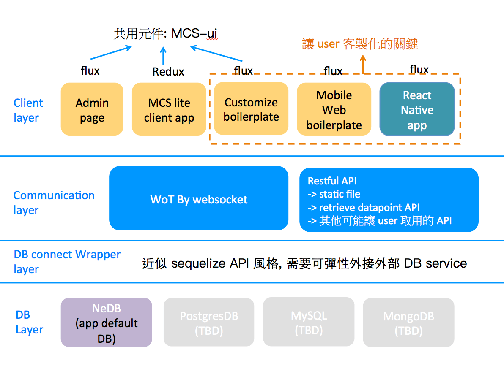
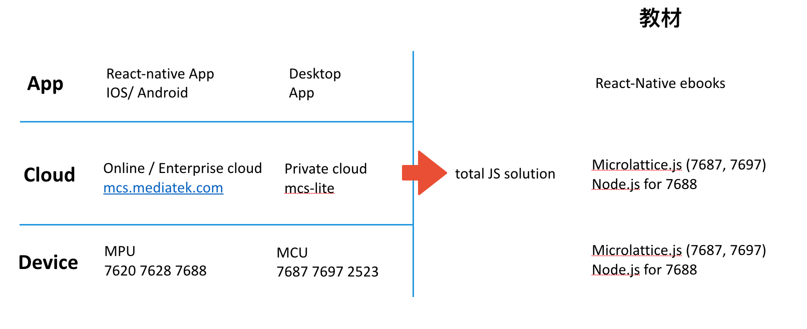

# 架構

## 技術亮點

### 輕量軟體 **(Lightweight)**

1. 各大平台 Binary 輸出，不需 setup VM 和 container，點兩下即可跑 Private cloud
2. 體積輕量，只要一個隨身碟給你完整雲端平台

### 彈性客製化（**Customize everything）**

1. 寫 Script 彈性最大
2. 眾多 boilerplate，用以滿足相關客製化 App/ mobile web/ public page/ dataChannel 教學參考，可參考範例：[cra-boilerplate](https://github.com/MCS-Lite/cra-boilerplate)

## 系統架構圖我們提供從 device 到 cloud 完整的 Javascript solution/ ecosystem

### 並**與第三方提供完整的教育訓練：**[**https://wotcity.com/node-iot**](https://wotcity.com/node-iot)

### 
