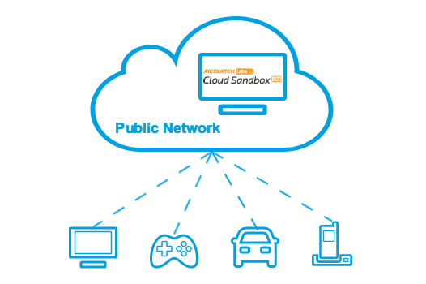
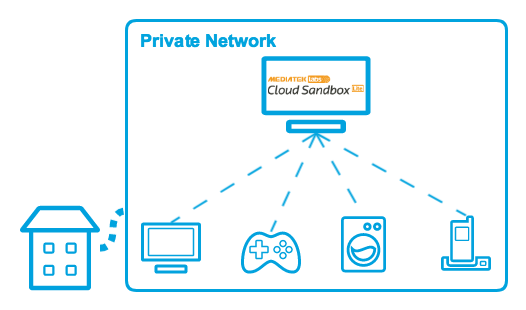
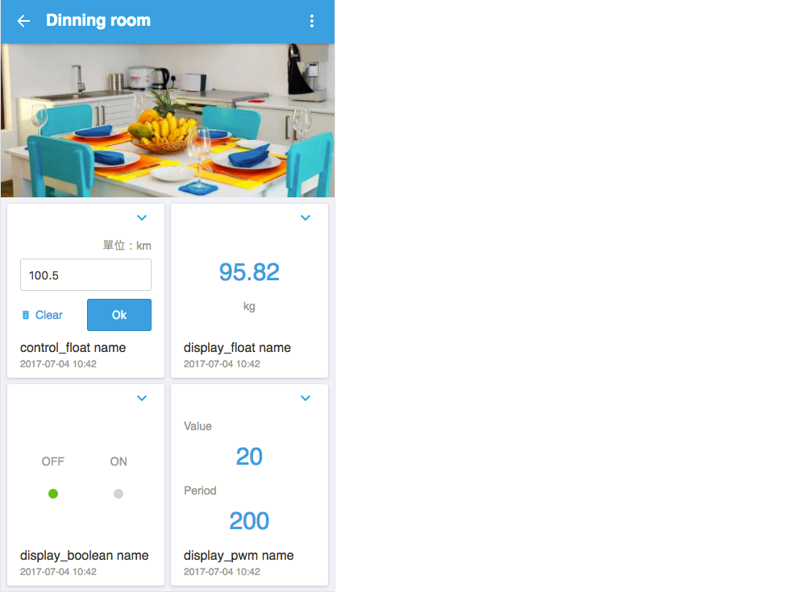
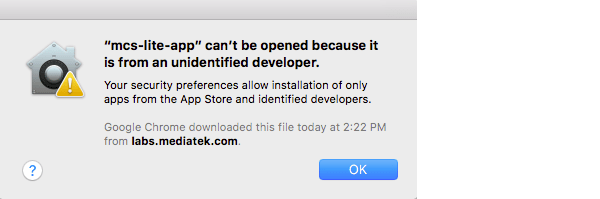
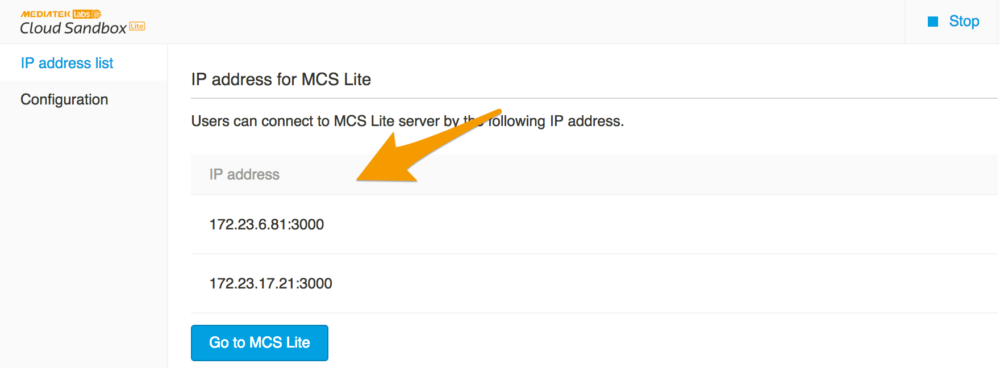

# 概述

## 功能介绍

无论您的电脑是位于私人或是公众网路，当您执行 MCS Lite 应用程式时，您的电脑就成为一个**专属的物联网平台 (IoT platform)**，同个网路中的连网装置皆可透过 MCS Lite 所提供的应用程式接口 (API) 开始与 MCS Lite 互动，包括上传以及接收资料。目前 MCS Lite 支援 HTTP 与 WebSocket 两种传输协定，有关应用程式接口 (APIs) 的使用方法在稍后的章节会有详细的介绍。

MCS Lite 轻松建置的特性，提高部署的弹性，让您不必再受限于网路连线与伺服器设定等因素，更能专注在物联网产品的创新应用与开发。

|||
|---|---|
|若您的电脑位于公用网路上，并且设定有一组公共网路位址 (public IP) 或是主机名称 (hostname)，在网际网路上的连网装置都可连接上您的 MCS Lite 物联网平台，但同时您依然保有自行维运及资料处理的专属权。|您也可以将 MCS Lite 运行在任何一个私人网路内，快速建立一个私有的物联网云平台，在同个网路内的装置可直接连接上您的 MCS Lite 物联网平台，降低对外网路可能造成的传输延迟或是机密资料流出的风险。|

MCS Lite 应用程式主要包含了**物联网平台 (IoT Platform)** 与**系统管理主控台**两个介面。使用者可以连上物联网平台设定产品原型以及与装置沟通的资料通道，另外在系统管理主控台上则提供让管理者设定 MCS Lite 连线与权限等进阶的管理功能。详细的功能如下：

1. **物联网平台 (IoT Platform)**

   * 透过标准的网路协定（HTTP or WebSocket）将测试装置产生的数据上传至 MCS Lite 储存并提供图形化的数据介面（当前资料与历史数据）。

   
   * 透过标准的网路协定（HTTP or WebSocket）远端控制您的测试装置。


   * 定义产品原型并且管理所有的测试装置。

   * 提供手机版本的操作介面。
 

   * 针对 LinkIt 7697 提供 MCS Lite 函式库，有助于简化并加速开发流程。

2. **系统管理主控台**

   * 启动或停止 MCS Lite 服务。
   * 显示服务器目前可连线的 IP 与 port 资讯。
   * 设定资料库与各项服务的连线方式。
   * 管理服务平台的使用者帐号与资料。

## 安装指南

1. 下载 MCS Lite 应用程式。[点我下载](https://github.com/MCS-Lite/mcs-lite-app/releases)
2. 将下载后的档案解压缩，产生的资料夹可以搬迁或复制到任意的目录底下。
3. 执行 **mcs-lite-app** 档案，开启系统管理主控台。此时，物联网平台 (IoT Platform) 尚未启动。

   * 如果您是在 MacOS 上第一次执行 **mcs-lite-app** 或是更换过档案路径，请务必先执行 **setup** 脚本程式，重新初始化 config.json 的所在路径。
   * 如果您是在 MacOS 上执行 **mcs-lite-app**，可能会看到如下的警告视窗将 **mcs-lite-app** 判定成未识别的开发者，可透过按滑鼠右键来开启。  
     

4. 第一次使用，请先注册一个管理者帐户，若您没有看到注册画面，请直接在浏览器输入 **http://localhost:3002/admin/signup**，手动开启注册页面。完成注册后，登入系统管理主控台。
	

5. 按下系统管理主控台右上角的 **启动** 按钮，开始运行 MCS Lite 物联网平台(IoT Platform)。
	
	 
6. 在 **IP 连线** 页面会列出目前 MCS Lite 物联网平台 (IoT Platform) 所绑定的位址 (IP) 与连接埠 (port) 列表。
	
	
7. 同个网路内的电脑皆可在浏览器的网址列中输入列出的位址 (IP) 与连接埠 (port) ，连线到 MCS Lite 物联网平台的网页。
   
   
8. 同个网路内的装置亦可开始透过 MCS Lite 提供的 APIs 上传或是接收资料。

	```
	POST /api/devices/HJZyx1bFQZ/datapoints.csv HTTP/1.1
	Host: localhost:3000
	Connection: keep-alive
	content-type: text/csv
	deviceKey: b90284ea31ea7df19e5b159f66721f1ac14ddb0150275d066ac6eb86e6a5eb20
	Content-Length: 19

	display_integer,,43
	```

## 系统需求

### 作业系统

| **作业系统** | **版本** |
| :--- | :--- |
| Windows | Windows 7 and above |
| MacOS | 10.12 Sierra and above |
| Others | MCS Lite 亦可安装在其他多种作业环境之下，但部分功能可能受限，且安装方式各有不同，请参考[附录A](/mcs_lite_platform.md)。 |

### 硬体

* 400 MHz 以上或更快的 32 位元 \(x86\) 或 64 位元 \(x64\) 处理器

* 建议最少 256 MB RAM

* 2 GB 的可用硬碟空间

* 区域网路存取

* 相关防火墙开启 3000, 8000, 8888 port （可以在[系统管理主控台](/mcs_lite_usage/mcs_lite_admin_usage.md)使用说明查看如何修改相关设定 ）
