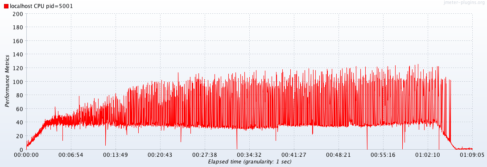

### 附录 B：效能与负载测试
由于物联网平台主要功能就是资料的收集与远端控制，因此本次测试情境主要为透过 **WebSocket** 上传与下载资料点。

#### System Spec
| OS | CPU | Memory |
| :--- | :--- | :--- |
|macOS 10.12.4 on MacBook Pro|Processor Name: Intel Core i5  Processor Speed: 2.7 GHz  Number of Processors: 1  Total Number of Cores: 2 |8 GB|

#### Test Scenario
| MCS Lite Server | Thread Number | Duration | Target RPS | 
| :-------------- | :------------ | :-------- | :--------- | 
|localhost| 20 | 1 hour | 200 |

#### Test Result
|Average Throughput| Average Response Time|
|:---|:---|:---|
| 166 req/sec | 99 ms |

经由下面的图表可以看到 MCS Lite server 每秒可以处理约 150~200 个请求，但随着系统运作的时间越长，虽然 WebSocket 的回应时间都是固定没有太大的起伏，而 RESTful API 则是相对要多更多的回应时间。主要是因为目前 MCS Lite 所搭配的是 NeDB，而 NeDB 会将资料全数载入记忆体当中，因此当资料量越来越大时，程式的效能的确会出现变慢的现象。

以测试当时硬体规格来说，建议每个 NeDB 档案大小不超过 **100 MB** 为佳。

##### Transaction per second

##### Response time

#### Memory usage

#### CPU usage
