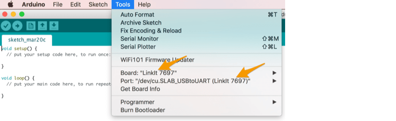
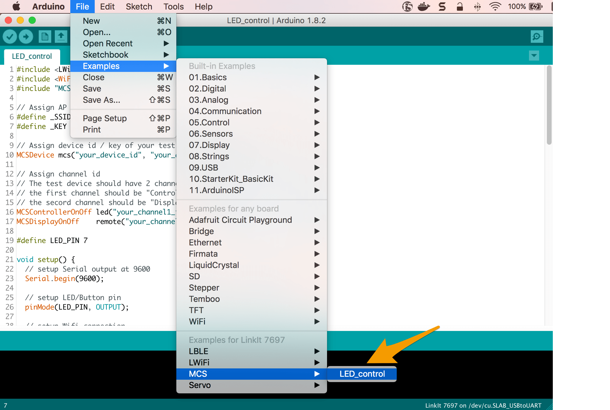
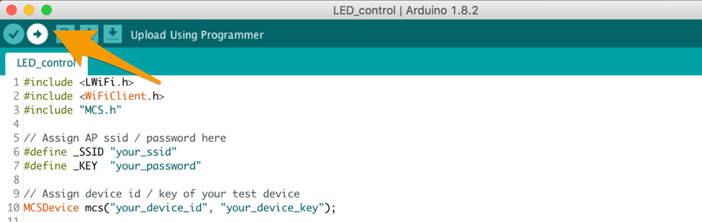
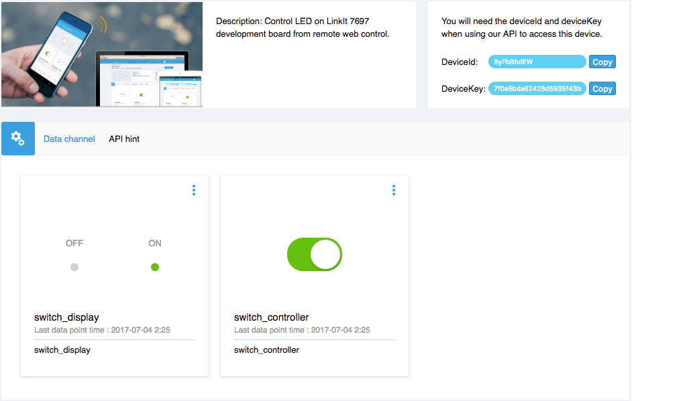

# Arduino 范例
## 远端控制 LED 明灭

我们将使用 LinkIt 7697 Arduino 与 MCS Lite 伺服器沟通。利用 MCS Lite 开关型别的资料通道控制 LinkIt 7697 开发板上 USR LED 灯号的明灭，并且回传 USR LED 当前的状态到另一个资料通道上。

在此，我们提供了两种实作方式，第一个是透过 MCS 函式库，透过叫用已经封装好的函示来快速的完成与 MCS Lite 服务器的连线与操作。

若您想要更深入的了解 MCS Lite 底层的设计与通讯协定，您也可以参考第二种方法，从无到有，实作与 MCS Lite 的 WebSocket 与 RESTful APIs 连线。

### 方法一：使用 MCS 函式库
LinkIt 7697 的 Arduino board support package 中包含了 MCS 函式库，您可以使用这个函式库来实作与 MCS 或 MCS Lite 伺服器之间的操作，这也是相对简单又快速的方式。其提供的功能包括：

* 连线到指定的 MCS 或 MCS Lite 服务器。
* 建立资料通道。
* 上传资料到 MCS 或 MCS Lite 服务器。
* 从 MCS 或 MCS Lite 服务器接收资料。

若您连接的是 MCS Lite 平台，可透过 **MCSLiteDevice** 类别来建构连线资讯。

```cpp
MCSLiteDevice(const String& device_id, const String& device_key, const String& server, int port);
```

* **device_id**: 在 MCS Lite 上建立的测试装置的 ID
* **device_key**: 在 MCS Lite 上建立的测试装置的 Key
* **server**: MCS Lite 所运行的伺服器的网路位址，可以是 IP 或是主机名称
* **port**: MCS Lite 服务中，RESTful API 所使用的连接埠，预设是 3000

有关 MCS 函式库更详细的介绍请参考 [Labs 官方文件](https://docs.labs.mediatek.com/resource/linkit7697-arduino/en/using-mcs-library)。


现在我们就用 MCS 函式库的范例让您的 LinkIt 7697 连上 MCS Lite，并且可以在 MCS Lite 网页介面上控制 LinkIt 7697 的 LED 灯。

#### 前置作业

1. 设定 LinkIt 7697 的 Arduino IDE 开发环境，详细步骤请参考 [Labs 官方文件](https://docs.labs.mediatek.com/resource/linkit7697-arduino/en/setup-arduino-ide-for-linkit-7697)。
2. 将 LinkIt 7697 连接到您的电脑，详细步骤请参考 [Labs 官方文件](https://docs.labs.mediatek.com/resource/linkit7697-arduino/en/connecting-linkit-7697-to-computer)。
3. 启动 MCS Lite Application，开启浏览器前往 MCS Lite 页面，建立一个产品原型，定义资料通道并且新增一个测试装置。本范例会使用到的资料通道为：

	* 开关控制器：资料通道 ID 为 **switch_controller**
	* 开关显示器：资料通道 ID 为 **switch_display**

	在 MCS Lite 网页上，您可手动建立或是直接**汇入产品原型**。[下载原型范本](https://github.com/MCS-Lite/mcs-lite-example/blob/master/LinkIt_7697/Arduino/mcs-lite-prototype-led-example.json)
	
	若您更改了资料通道 ID，请记得要更改程式码中对应的 ID 与变数喔。

#### 使用内建的 MCS > LED_control 范例
1. 开启 Arduino IDE，在 Tools > Board 中选取 **LinkIt 7697**。在 Tools > Port 中选取 LinkIt 7697 所连接的序列埠，此序列埠的后方会标示 **(LinkIt 7697)**。 
2. 接着选取 File > Examples > MCS > LED_control 开启 MCS 的范例程式。

3. 根据您的网路环境与 MCS Lite 设定修改代码中的变数。
	* 首先，修改 WiFi 连线的设定
	
	```arduino
	// Assign AP ssid/password here
	#define _SSID "your_ssid"
	#define _KEY  "your_password"
	``` 
	
	* 再将范例程式中的 **MCSDevice** 修改成 **MCSLiteDevice**，并将对应的 Device ID, Device Key 与 MCS Lite 服务器连线资讯带入，例如
	
	```arduino
	// Assign device id/key of your test device
	// MCSDevice mcs("your_device_id", "your_device_key");
	MCSLiteDevice mcs("Drcsun...", "YGsl0go...", "192.169.1.100", 3000);
	```
	
	* 将先前在 MCS Lite 网页上建立的资料通道 ID 带入，例如
	
	```arduino
	// Assign data channel ID
	MCSControllerOnOff led("switch_controller");
	MCSDisplayOnOff    remote("switch_display");
	```
4. 修改完成后，在 Arduino IDE 上点击 **Upload** 按钮，编译并将代码上传到 LinkIt 7697 开发板上。
5. 上传完成后，将画面切换到 MCS Lite 的测试装置详情页面。在 MCS Lite 页面上操作开关类型的控制器，当开关切换至**开启**状态时， LinkIt 7697 开发板上的 **USR LED** 灯号会亮起，并且上传开启状态（布林值 1）到开关类型的显示器；反之，LED 灯号将熄灭，并且上传关闭的状态（布林值 0）。

	**MCS Lite 测试装置操作页面** 
	
	**LinkIt 7697 USR LED 灯号** 
	
	
### 方法二：自行实作与 MCS Lite 的 WebSocket 和 RESTful APIs 的连线
相较于**方法一：使用 MCS 函式库**，方法二相对较为复杂，且必须自行解析所接收到的数据与指令，因此在有提供 MCS 函式库的开发板（如 LinkIt 7697）上进行 MCS 或 MCS Lite 相关的开发时，仍建议直接使用 MCS 函式库。此范例可作为在尚未提供 MCS 函式库的装置上开发时的参考。

#### 前置作业

1. 设定 LinkIt 7697 的 Arduino IDE 开发环境，详细步骤请参考 [Labs 官方文件](https://docs.labs.mediatek.com/resource/linkit7697-arduino/en/setup-arduino-ide-for-linkit-7697)。
2. 将 LinkIt 7697 连接到您的电脑，详细步骤请参考 [Labs 官方文件](https://docs.labs.mediatek.com/resource/linkit7697-arduino/en/connecting-linkit-7697-to-computer)。
3. 启动 MCS Lite Application 后，开启浏览器前往 MCS Lite 页面，建立一个产品原型，定义资料通道并且新增一个测试装置。本范例会使用到的资料通道为：

	* 开关控制器：资料通道 ID 为 **switch_controller**
	* 字串显示器：资料通道 ID 为 **string_display**

	在 MCS Lite 网页上，您可手动建立或是直接**汇入产品原型**。[下载原型范本](https://github.com/MCS-Lite/mcs-lite-example/blob/master/LinkIt_7697/Arduino/mcs-lite-prototype-led-example.json)
	
	若您更改了资料通道 ID，请记得要更改程式码中对应的 ID 与变数喔。

#### 使用 LED Blink 范例

1. 开启 Arduino IDE，在 Tools > Board 中选取 **LinkIt 7697**。在 Tools > Port 中选取 LinkIt 7697 所连接的序列埠，此序列埠的后方会标示 **(LinkIt 7697)**。 
2. 将 [LED Blink Example](https://github.com/MCS-Lite/mcs-lite-example/blob/master/LinkIt_7697/Arduino/LED_controller.ino) 的程式码复制贴上于 Arduino IDE 编辑器中，并根据您的网路环境与 MCS Lite 设定修改代码中的变数，例如

	```arduino
	char ssid[] = "mcs";  
	char pass[] = "mcs123";  
	char deviceId[] = "HydTsgYie";  
	char deviceKey[] = 	"96e2478320088f10242360c768fce82faf119fd38524afc8c461e5da9b20300c";  
	char server[] = "192.168.1.241";  
	int ws_port = 8000;  
	int rs_port = 3000
	```
	
	* **ssid**: 所要连接的无线网路识别名称
	* **pass**: 所要连接的无线网路密码
	* **device ID**: 在 MCS Lite 上建立的测试装置的 ID
	* **device Key**: 在 MCS Lite 上建立的测试装置的 Key
	* **server**: MCS Lite 所运行的伺服器的网路位址，可以是 IP 或是主机名称
	* **ws_port**: MCS Lite 服务中，WebSocket 所使用的连接埠，预设是 8000
	* **rs_port**: MCS Lite 服务中，RESTful API 所使用的连接埠，预设是 3000

3. 在 Arduino IDE 上点击 **Upload** 按钮，将修改后的代码上传到 LinkIt 7697 开发板上。
	
4. 上传完成后，将画面切换到 MCS Lite 的测试装置详情页面。在 MCS Lite 页面上操作开关类型的控制器，当开关切换至开启状态时， LinkIt 7697 开发板上的 **USR LED** 灯号会亮起，并且上传 **LED is ON** 字串到字串类型的显示器；反之，LED 灯号将熄灭，并且上传 **LED is OFF** 的字串。

	**MCS Lite 测试装置操作页面** 	
	**LinkIt 7697 USR LED 灯号** 

#### 代码解说
在这个范例中，我们首先与 MCS Lite 伺服器建立起了 WebSocket 连线，用来接收来自伺服器端所发送的指令。WebSocket 的连线是永久性的，一但建立之后，会定期发送 heartbeat 通知伺服器此装置依然存活，保持连线。

**在 setup() 中呼叫 connectWs() 建立 WebSocket 连线**

```arduino
void setup() {
	...
	// 组 WebSocket 的请求封包
  	request += "GET /deviceId/";
	...
  	request += "\r\nOrigin: null\r\n\r\n";
  	// 呼叫 WebSocket 连线函式
  	connectWs();
}
void connectWs () {
	if (ws_client.connect(server, ws_port)) {
		Serial.println("connected to ws_server");
		...
       }
}
```

**在 loop() 中对 MCS Lite 伺服器发送 WebSocket heartbeat，并且接收来自伺服器端的指令/资料**

```arduino
void loop() {
	...
	//当 WebSocket 连线建立时，每 10 秒送出 heartbeat 封包
  	while (ws_client.available()) {
     	if(lastTime == 0) {
        	lastTime = millis();
      	} else {
        	int thisTime = millis();
        	if(thisTime - lastTime > 10 * 1000) {
          	unsigned char frame;
          	frame = 0x01; // FIN
          	frame = (0x01 << 4);
          	ws_client.print(frame);
          	lastTime = millis();
       	 }
      }
     
      //读取 MCS Lite 伺服器送出的指令/资料
      int v = ws_client.read();
     
      if (v != -1) {
        	wscmd += (char)v;  
        	//透过字串比对的方式，当收到的字串与先前定义的 switch_on 字串相同时，开启 USR LED，其中 USR LED 是对应到 LinkIt 7697 的 P7 角位
        	if (wscmd.substring(2).equals(switch_on)){
          	digitalWrite(7, HIGH);
          	String data = "string_display,,LED is ON";
          	upload_datapoint(data);
          	wscmd = "";
          //透过字串比对的方式，当收到的字串与先前定义的 switch_off 字串相同时，关闭 USR LED，其中 USR LED 是对应到 LinkIt 7697 的 P7 角位
        	} else if (wscmd.substring(2).equals(switch_off)){
          	digitalWrite(7, LOW);
          	String data = "string_display,,LED is OFF";
          	upload_datapoint(data);
          	wscmd = "";
        		}
      	}
  	}
	...
}
```
在上述的范例中，我们简单采取字串比对的方式，来判别开与关的指令，您可以进一步透过 JSON parser 来处理所接收到的 JSON 格式的指令/资料。

同时，您可能也会发现到，在接收处理 WebSocket 的资料时，我们同时也呼叫了 **upload_datapoint()** 函式，透过 RESTful API 上传一个字串到 MCS Lite 伺服器。其中 **string_display** 为我们先前所定义的资料通道 ID。

```arduino
if (wscmd.substring(2).equals(switch_on)){
	digitalWrite(7, HIGH);
	String data = "string_display,,LED is ON";
   	upload_datapoint(data);
	wscmd = "";
} else if (wscmd.substring(2).equals(switch_off)){
	digitalWrite(7, LOW);
   	String data = "string_display,,LED is OFF";
   	upload_datapoint(data);
	wscmd = "";
}
```

```arduino
void upload_datapoint(String content) {
	if (rs_client.connect(server, rs_port)) {
    	Serial.println("rs_client is built.");
    	int thislength = content.length();
    	rs_client.print("POST /api/devices/");
    	...
    	rs_client.println(); 
   		while(!rs_client.available())
    	{
      		delay(10);
    	}
  	}
  	Serial.println("rs_client is closed.");
  	rs_client.stop();
}
```