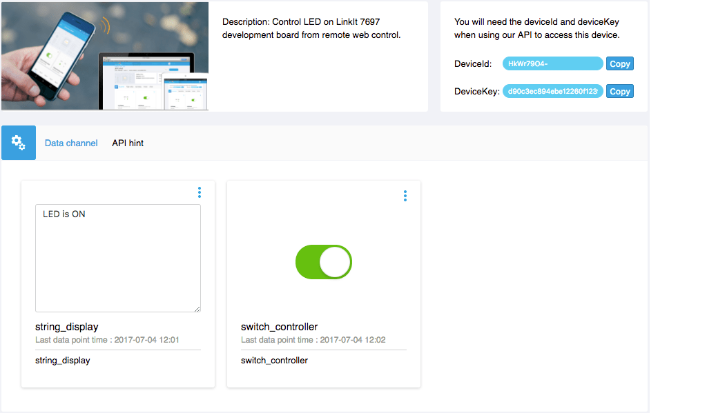

# LinkIt SDK 范例
## 远端控制 LED 明灭

我们将使用 LinkIt 7697 SDK GCC 的开发环境来实作与 MCS Lite 伺服器沟通。利用 MCS Lite 开关型别的资料通道控制 LinkIt 7697 开发板上 USR LED 灯号的明灭，并且回传 USR LED 当前的状态到另一个资料通道上。

### 前置作业

1. 设定 LinkIt 7697 的 GCC ARM Embedded 开发环境，详细步骤请参考 [Labs 官方文件](https://docs.labs.mediatek.com/resource/mt7687-mt7697/en/get-started-linkit-7697-hdk/gcc-arm-embedded-linkit-7697)。
2. 将 LinkIt 7697 连接到您的电脑，详细步骤请参考 [Labs 官方文件](https://docs.labs.mediatek.com/resource/mt7687-mt7697/en/get-started-linkit-7697-hdk/gcc-arm-embedded-linkit-7697/connect-linkit-7697-to-computer)。
3. 启动 MCS Lite Application，开启浏览器前往 MCS Lite 页面，建立一个产品原型，定义资料通道并且新增一个测试装置。本范例会使用到的资料通道为：

	* 开关控制器：资料通道 ID 为 **switch_controller**
	* 开关显示器：资料通道 ID 为 **switch_display**

	在 MCS Lite 网页上，您可手动建立或是直接**汇入产品原型**。[下载原型范本](https://github.com/MCS-Lite/mcs-lite-example/blob/master/LinkIt_7697/GCC/mcs-lite-prototype-led-example.json)
	
	若您更改了资料通道 ID，请记得要更改程式码中对应的 ID 与变数喔。


### 动手实作

1. 下载 [LED Blink Example](https://github.com/MCS-Lite/mcs-lite-example/tree/master/LinkIt_7697/GCC/LED_controller) 并将 **LED\_controller** 资料夹放置到 **{SDK\_root}/project/linkit7697\_hdk/apps** 目录之下。
2. 修改 **LED\_controller/src/main.c** 档案，配置开发版的网路设定相关参数以及 MCS Lite 的连线资讯，例如
		
	```arduino
	// Input your Wi-Fi setting here 
	#define SSID "mcs"
	#define PASSWORD "mcs1234"
	
	//Input MCS Lite websocket server here
	#define WEBSOCKET_SERVER "192.168.1.241"
	#define WEBSOCKET_PORT 8000
	
	//Input MCS Lite RESTful server here
	#define API_SERVER "192.168.1.241"
	#define API_PORT 3000
	
	// Input MCS Lite device ID and Key here
	#define DEVICE_ID "Bk1chnjbW"
	#define DEVICE_KEY "0676619c94374d542fc8421d0ed73ad3e189c03459453c214a8276cb26c341db"
	```

	* **SSID**: 您 Wi-Fi AP 的 SSID
	* **PASSWORD**: 您 Wi-Fi AP 的密码
	* **WEBSOCKET_SERVER**: MCS Lite 所运行的 WebSocket 伺服器的网路位址，可以是 IP 或是主机名称
	* **WEBSOCKET_PORT**: MCS Lite 服务中，WebSocket 所使用的连接埠，预设是 8000
	* **API_SERVER**: MCS Lite 所运行的 RESTful API 伺服器的网路位址，可以是 IP 或是主机名称
	* **API_PORT**: MCS Lite 服务中，RESTful API 所使用的连接埠，预设是 3000
	* **DEVICE_ID**: 在 MCS Lite 上建立的测试装置的 ID
	* **DEVICE_KEY**: 在 MCS Lite 上建立的测试装置的 Key

3. 接着，就可以开始透过 GCC 编译并建立您的专案了。现在确认已经储存修改过的程式码，然后切换到 **GCC** 子资料夹，并执行 **make** 命令。
	
	```bash
	cd {SDK_Root}/project/linkit7697_hdk/apps/my_project/GCC
	make
	```
	或是切换到 **{SDK\_Root}** 资料夹，并执行 **.\\build.sh** 脚本。
	
	```bash
	cd {SDK_Root}
	./build.sh linkit7697_hdk LED_controller
	```
	
4. 建置完成后产生的二进位档案会置放在 **{SDK\_root}/project/linkit7697\_hdk/apps/LED_controller/GCC/Build** 资料夹中。此时，您就可以使用 SDK 中的 **Flash Tool** 将编译好的二进位档案下载至开发板。详细步骤请参考 [Labs 官方文件](https://docs.labs.mediatek.com/resource/mt7687-mt7697/en/get-started-linkit-7697-hdk/gcc-arm-embedded-linkit-7697/download-project-binary-with-flash-tool-linkit-7697)。

5. 下载完成后，将画面切换到您的浏览器并开启 MCS Lite 的测试装置详情页面。在 MCS Lite 页面上操作开关类型的控制器，当开关切换至**开启**状态时， LinkIt 7697 开发板上的 **USR LED** 灯号会亮起，并且上传 **LED is ON** 字串到字串类型的显示器；反之，LED 灯号将熄灭，并且上传 **LED is OFF** 的字串。

	**MCS Lite 测试装置操作页面** 
	
	**LinkIt 7697 USR LED 灯号** 
	
	
### 代码解说

在这个范例的 **main.c** 程序中，我们会在装置的 Wi-Fi 网路连线成功后建立与 MCS Lite 伺服器的 WebSocket 连线，用来接收来自伺服器端所发送的指令，再交由 **tcp\_callback()** 这个函式做处理。WebSocket 的连线是永久性的，一但建立之后，会定期发送 heartbeat 通知伺服器此装置依然存活，保持连线。


在 **tcp\_callback()** 函式中，我们使用了 cJSON 函式库来处理来自 MCS Lite 的 JSON 格式的指令/资料，判别开与关的指令。

同时，在接收处理 WebSocket 的资料时，我们同时也呼叫了 **mcs\_upload\_datapoint()** 函式，透过 RESTful API 上传一个字串到 MCS Lite 伺服器。其中 **string_display** 为我们先前所定义的资料通道 ID。
