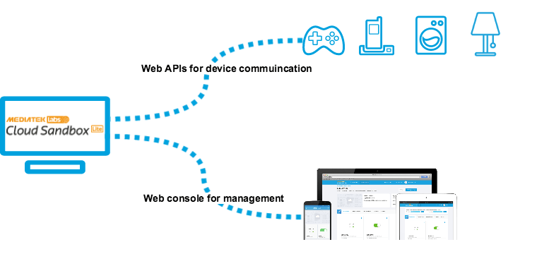
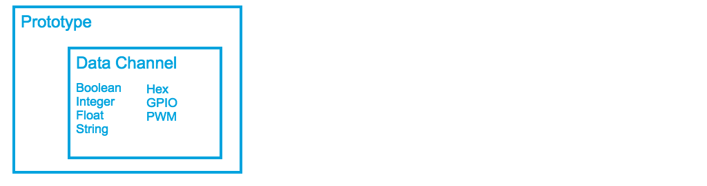
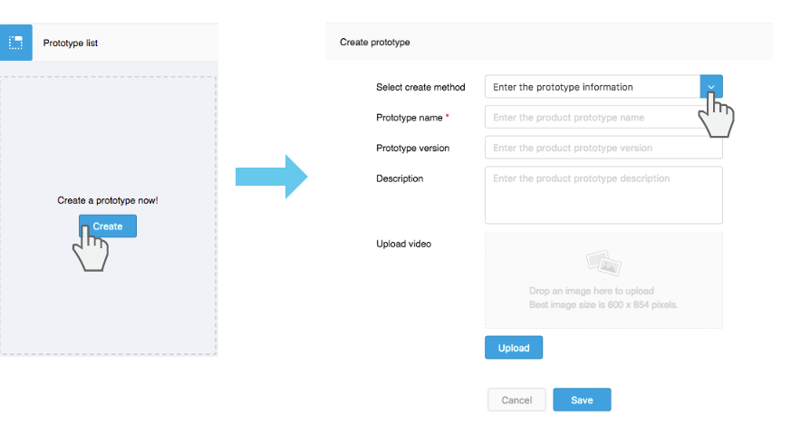
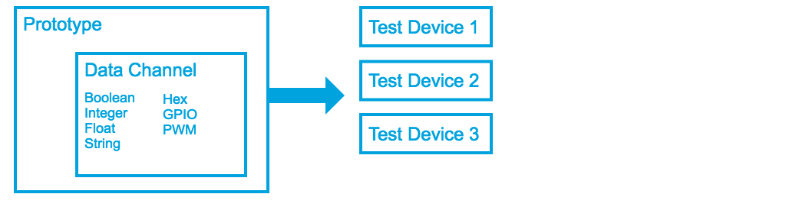
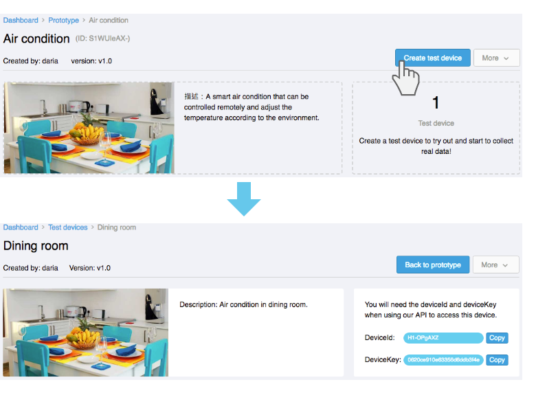
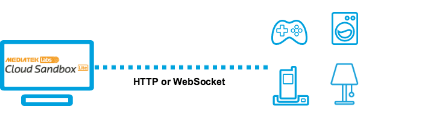
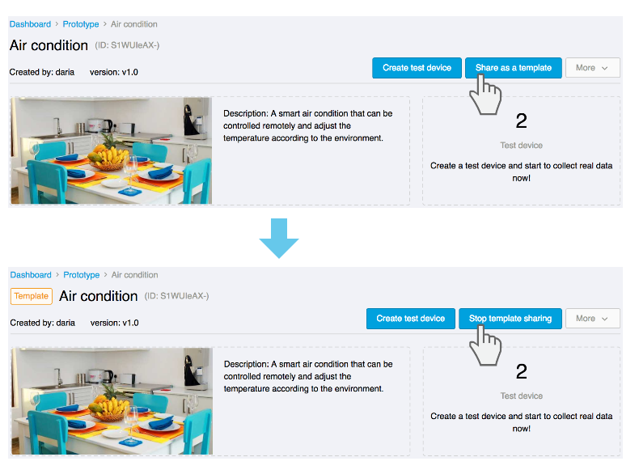

# 物联网平台使用说明

如果您先前已经使用过 MediaTek Cloud Sandbox (MCS) 服务，您应该会对 MCS Lite 的操作介面相当熟悉。您只需要在浏览器的网址列上输入 MCS Lite 所绑定的 IP 位址与连接埠即可连上本地端的 MCS Lite 服务平台。有关 MCS Lite 在您本地端的连线资讯，请洽您的系统管理员。

MCS Lite 与 MCS 相同，能让使用者透过网页介面先行定义自己的产品原型与管理测试装置，接着实体装置便可呼叫 MCS Lite 提供的 web APIs 开始上传与接收资料。如果您之前未曾使用过 MCS 服务，可先透过以下几个重要的名词介绍来了解如何在 MCS Lite 上建立测试装置，接收资料并实现远端遥控。

## 产品原型

### 何谓产品原型？

产品原型（prototype）是您在开发时设计的产品蓝图。主要定义了

#### **资料通道（Data Channel）**

资料通道是用来定义装置与 MCS Lite 之间传递的数据的型态，让 MCS Lite 能正确地分辨与储存这些数据，并产生对应的历史图表。资料通道有以下两种类型：

* **显示器（Display）**：由装置的感应元件搜集而回传到 MCS Lite 并显示在 MCS Lite 页面上的数据。

* **控制器（Controller）**：透过 MCS Lite 传送给装置的指令或数据。

為了能显示及处理不同类型的数据，MCS Lite 提供以下几种资料型态的通道：

* **布林开关（Boolean）：**用布林值来显示/操作装置的开机与关机两种状态。

* **整数（Integer）**：用来显示/设定任意的整数，例如显示使用者一天走了多少步數。

* **浮点数（Float）**：用来显示/设定任意的浮点数，例如设定空调设备的温度。

* **字串（String）**：用来显示/设定任意的字串，例如显示装置当前韧体版本或时间。

* **十六进位数（Hex）**：用来显示/设定任意的十六进位数值，例如设定 LED 灯的显示颜色。

* **GPIO **：用来显示/设定 GPIO 的数位讯号。例如设定 Pin 4 角位为 High。

* **PWM **：用来显示/设定传递到 GPIO 的 PWM 数位讯号, 例如在 Pin 3 位置的 level 15 讯号。

### 如何建立产品原型？

在**开发** > **原型**页面，点击**创建**按钮后，您可透过以下三种方法来建立您的产品原型：

* 自行设定
  1. 点击画面上方的**开发**连结，并选择**产品原型**。
  2. 点击**创建**按钮，在**选择创建方式**栏位中保持预设的**输入原型资讯**。
  3. 输入产品原型名称与版本后点击**储存**按钮。您的产品原型已建立。
* 汇入 JSON 档 
  1. 点击画面上方的**开发**连结，并选择**产品原型**。  
  2. 点击**创建**按钮，在**选择创建方式**栏位中选择**汇入 JSON 档。**  
  3. 您可贴上或是**浏览上传** JSON 档案。点击**储存**按钮，您的产品原型已建立。  
  4. 如何取得/汇出产品原型 JSON 档案，请参考 [如何建立您的第一个产品原型](http://mcs.mediatek.com/resources/zh-CN/latest/tutorial/getting_started#建立您的第一个产品原型)

* 使用范例原型  
  1. 点击画面上方的**开发**连结，并选择**产品原型。**  
  2. 点击**创建**按钮，在**选择创建方式**栏位中选择**使用范例原型**。  
  3. 此时，**选择范例**的下拉选单中会出现由管理者预先建立好的范例原型，选择一个您所要的范例。  
  4. 您可以更改范例原型的基本资料，或维持原样直接储存建立。

当产品原型建立后，点击您刚建立的**详情**按钮则可以开始建立资料通道并且新增测试装置了。

## 测试装置

### 何谓测试装置？

如果说产品原型（prototype）是您开发与设计产品的蓝图，测试装置 (test device) 则是对应到一个个实体的设备。

您已完成建立产品原型与设定资料通道，然而，在开始收集数据或操作实体设备之前，您必须在产品原型下建立对应的测试装置，每一个测试装置都会有一组 **DeviceId** 和 **DeviceKey**，当您要将实体设备产生的数据回传到 MCS Lite 时，则可透过在回传讯息中指定装置的 ID 与 key 将资料储存到对应的测试装置中。

您可以在 产品原型**详情页面 > 测试装置**底下，查看此原型底下所有的测试装置，或选取特定测试装置来观看其收集的数据或进行远端操控。您亦可以修改或查看关于这个装置的详细资讯。

### 如何建立测试装置？

#### 在 MCS Lite 上建立测试装置

1. 点选产品原型的**详情**按钮。
2. 点选画面右上方的**创建测试装置**按钮。
3. 在创建测试装置对话窗中，输入测试装置名称和描述，然后点击**确定**按钮。
4. 在创建成功的讯息对话窗中，您可以直接点击**详细资料**按钮进入测试装置页面，或在产品原型详情页面中的测试装置分页内查看属于此产品原型的测试装置。

#### 设定实体装置与 MCS Lite 的连线

目前 MCS Lite 主要支援 WebSocket 与 HTTP 两种通讯协定，提供对应的 web APIs 让实体装置与 MCS Lite 物联网平台连线，上传并接收数据与指令。

更多有关使用 WebSocket 与 HTTP 上传接收数据的详系说明，请前往 **API 参考文件**。

## 原型范例

### 何谓原型范例？

**系统管理者**可将自己建立的产品原型分享给所有使用者，让使用者可以简单的复制并修改来产生自己的原型。这样的功能很适合应用在教学案例当中，老师可以先建立并分享范例原型给学生。或者是在开发团队中，预先定义好产品的原型，让开发者可以直接套用进行各别功能的开发。

### 如何建立原型范例？

只有**系统管理者**能拥有这个权限，当管理者使用自己的帐号密码登入 MCS Lite 物联网服务平台并建立一个产品原型后，可在产品原型的功能选单中看到**设为范本**选项。设定为范本的原型会出现有**原型范例**的标示。

### 如何复制原型范例？

当一个产品原型被设定为范例后，此系统所有的使用者皆可浏览并复制此原型。使用者可透过以下两个方式复制原型范例：

1. 在**仪表板**页面 &gt; **原型范例**区块 &gt; **与我分享的范例** &gt; 点击原型名称，可浏览原型的资料通道，或直接点击**使用范例创建原型**，复制建立您的原型。
2. 在**原型列表**页面 &gt; 点击**创建**按钮 &gt; 在**选择创建方式**栏位中选择 **使用范例原型** &gt; 在**选择范例**的下拉选单中选择一个您所要的范例，复制建立您的原型。

请注意，当原型范例被复制后，新的原型并不会与原型范例连动，因此，管理者若更改了原型范例，此更动并不会套用在已经建立的原型上。