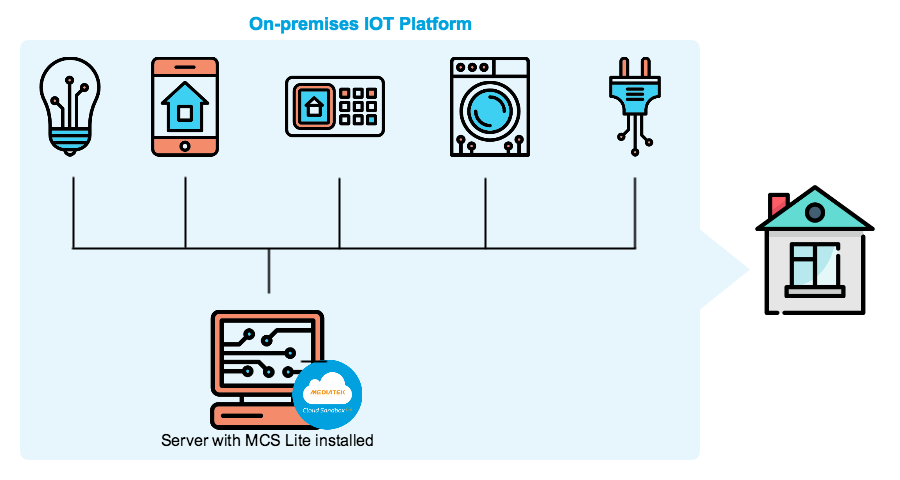

# 輕鬆搭建

如果您需要建構一個私有的物聯網服務平台，且正在尋找一個能快速安裝與上手的方案，那您一定不能錯過 **MCS Lite**。

**MediaTek Cloud Sandbox Lite Edition**（簡稱 **MCS Lite**），是根據聯發科技物聯網雲端平台 **MediaTek Cloud Sandbox**（簡稱 **MCS**）的核心功能改寫，開發成一個跨平臺的輕量級桌面應用程式，可運行在 Windows, Linux 和 Mac OS 等常用作業系統上。

MCS Lite 將運行網路應用平台所需的元件，包括資料庫，網頁伺服器與系統管理介面等都封裝在一個執行檔內。其執行檔的大小可以輕易的存入一般 USB 隨身碟，讓您可以更方便的攜帶並運行 MCS Lite 程序，輕輕鬆鬆讓您的電腦成為一個物聯網服務平台，開始與網路上的物聯網裝置溝通，收集裝置產生的數據或進行遠端操控與設定。

無論是應用於教育機構、軟硬體研發團隊、或是各種商業場域，也無論電腦主機是處於公眾網路或是私有網域內，您皆可透過 MCS Lite 實現裝置連網的第一步。

# 代碼開源

MCS Lite 是使用 MIT License 來進行授權的開源專案，您可以在 MIT License 的規範下，使用、重製、修改、出版、散布、再授權 MCS Lite 相關的專案。[點我前往 MCS Lite Github ](https://github.com/MCS-Lite)

MCS Lite 主要包含以下幾個專案與元件：

1. mcs-lite-app
   * MCS Lite application 執行檔的主要程式代碼。
2. mcs-lite
   * MCS Lite application 中有使用到的 UI 元件以及手機版本的使用介面。
3. cra-boilerplate
   * 使用 create-react-app 架構來客製化 MCS Lite application 的操作介面。

# 擴充無限

不管是要客製化平台的使用者介面，支援其他資料庫或是增加額外的資料分析與資料加密等功能，皆可透過直接修改代碼或使用 MCS Lite 提供的 API 來進一步的擴充功能。MCS Lite 開發團隊也會持續釋放出更多的範例供您參考：

介面客製化的範例：[cra-boilerplate](https://github.com/MCS-Lite/cra-boilerplate)

