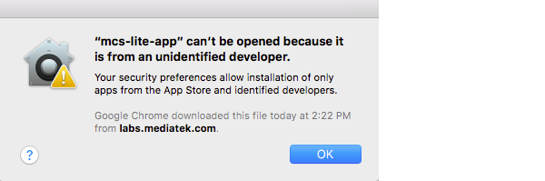
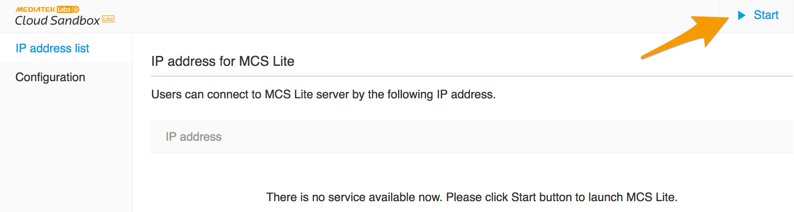
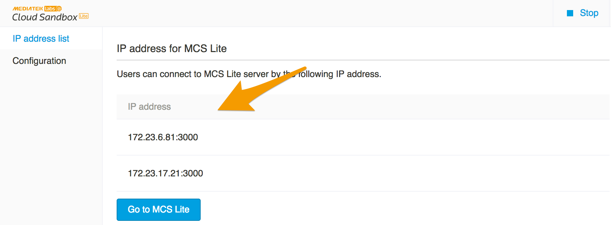

# 概述

## 功能介紹

無論您的電腦是位於私人或是公眾網路，當您執行 MCS Lite 應用程式時，您的電腦就成為一個**專屬的物聯網平台 (IoT platform)**，同個網路中的連網裝置皆可透過 MCS Lite 所提供的應用程式接口 (API) 開始與 MCS Lite 互動，包括上傳以及接收資料。目前 MCS Lite 支援 HTTP 與 WebSocket 兩種傳輸協定，有關應用程式接口 (APIs) 的使用方法在稍後的章節會有詳細的介紹。

MCS Lite 輕鬆建置的特性，提高部署的彈性，讓您不必再受限於網路連線與伺服器設定等因素，更能專注在物聯網產品的創新應用與開發。

|||
|---|---|
|若您的電腦位於公用網路上，並且設定有一組公共網路位址 (public IP) 或是主機名稱 (hostname)，在網際網路上的連網裝置都可連接上您的 MCS Lite 物聯網平台，但同時您依然保有自行維運及資料處理的專屬權。|您也可以將 MCS Lite 運行在任何一個私人網路內，快速建立一個私有的物聯網雲平台，在同個網路內的裝置可直接連接上您的 MCS Lite 物聯網平台，降低對外網路可能造成的傳輸延遲或是機密資料流出的風險。|

MCS Lite 應用程式主要包含了**物聯網平台 (IoT Platform)** 與**系統管理主控台**兩個介面。使用者可以連上物聯網平台設定產品原型以及與裝置溝通的資料通道，另外在系統管理主控台上則提供讓管理者設定 MCS Lite 連線與權限等進階的管理功能。詳細的功能如下：

1. **物聯網平台 (IoT Platform)**

   * 透過標準的網路協定（HTTP or WebSocket）將測試裝置產生的數據上傳至 MCS Lite 儲存並提供圖形化的數據介面（當前資料與歷史數據）。

   
   * 透過標準的網路協定（HTTP or WebSocket）遠端控制您的測試裝置。


   * 定義產品原型並且管理所有的測試裝置。

   * 提供手機版本的操作介面。
 

   * 針對 LinkIt 7697 提供 MCS Lite 函式庫，有助於簡化並加速開發流程。

2. **系統管理主控台**

	* 啟動或停止 MCS Lite 服務。
   * 顯示服務器目前可連線的 IP 與 port 資訊。
   * 設定資料庫與各項服務的連線方式。
   * 管理服務平台的使用者帳號與資料。

## 安裝指南

1. 下載 MCS Lite 應用程式。[點我下載](https://github.com/MCS-Lite/mcs-lite-app/releases)
2. 將下載後的檔案解壓縮，產生的資料夾可以搬遷或複製到任意的目錄底下。
3. 執行 **mcs-lite-app** 檔案，開啟系統管理主控台。此時，物聯網平台 (IoT Platform) 尚未啟動。

   * 如果您是在 MacOS 上第一次執行 **mcs-lite-app** 或是更換過檔案路徑，請務必先執行 **setup** 腳本程式，重新初始化 config.json 的所在路徑。
   * 如果您是在 MacOS 上執行 **mcs-lite-app**，可能會看到如下的警告視窗將 **mcs-lite-app** 判定成未識別的開發者，可透過按滑鼠右鍵來開啟。  
     

4. 按下系統管理主控台右上角的 **啟動** 按鈕，開始運行 MCS Lite 物聯網平台 (IoT Platform)。
	 
	 
5. 在 **IP 連線** 頁面會列出目前 MCS Lite 物聯網平台 (IoT Platform) 所綁定的位址 (IP) 與連接埠 (port) 列表。
	
	
6. 同個網路內的電腦皆可在瀏覽器的網址列中輸入列出的位址 (IP) 與連接埠 (port) ，連線到 MCS Lite 物聯網平台的網頁。
   
   
7. 同個網路內的裝置亦可開始透過 MCS Lite 提供的 APIs 上傳或是接收資料。

	```
	POST /api/devices/HJZyx1bFQZ/datapoints.csv HTTP/1.1
	Host: localhost:3000
	Connection: keep-alive
	content-type: text/csv
	deviceKey: b90284ea31ea7df19e5b159f66721f1ac14ddb0150275d066ac6eb86e6a5eb20
	Content-Length: 19

	display_integer,,43
	```

## 系統需求

### 作業系統

| **作業系統** | **版本** |
| :--- | :--- |
| Windows | Windows 7 and above |
| MacOS | 10.12 Sierra and above |
| Others | MCS Lite 亦可安裝在其他多種作業環境之下，但部分功能可能受限，且安裝方式各有不同，請參考[附錄A](/mcs_lite_platform.md)。 |

### 硬體

* 400 MHz 以上或更快的 32 位元 \(x86\) 或 64 位元 \(x64\) 處理器

* 建議最少 256 MB RAM

* 2 GB 的可用硬碟空間

* 區域網路存取

* 相關防火牆開啟 3000, 8000, 8888 port （可以在[系統管理主控台](/mcs_lite_usage/mcs_lite_admin_usage.md)使用說明查看如何修改相關設定 ）
