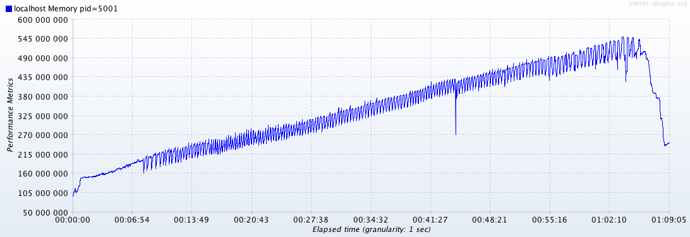

### 附錄 B：效能與負載測試
由於物聯網平台主要功能就是資料的收集與遠端控制，因此本次測試情境主要為透過 **WebSocket** 上傳與下載資料點。

#### System Spec
| OS | CPU | Memory |
| :--- | :--- | :--- |
|macOS 10.12.4 on MacBook Pro|Processor Name: Intel Core i5  Processor Speed: 2.7 GHz  Number of Processors: 1  Total Number of Cores: 2 |8 GB|

#### Test Scenario
| MCS Lite Server | Thread Number | Duration | Target RPS | 
| :-------------- | :------------ | :-------- | :--------- | 
|localhost| 20 | 1 hour | 200 |

#### Test Result
|Average Throughput| Average Response Time|
|:---|:---|:---|
| 166 req/sec | 99 ms |

經由下面的圖表可以看到 MCS Lite server 每秒可以處理約 150~200 個請求，但隨著系統運作的時間越長，雖然 WebSocket 的回應時間都是固定沒有太大的起伏，而 RESTful API 則是相對要多更多的回應時間。主要是因為目前 MCS Lite 所搭配的是 NeDB，而 NeDB 會將資料全數載入記憶體當中，因此當資料量越來越大時，程式的效能的確會出現變慢的現象。

以測試當時硬體規格來說，建議每個 NeDB 檔案大小不超過 **100 MB** 為佳。

##### Transaction per second

##### Response time

#### Memory usage

#### CPU usage
