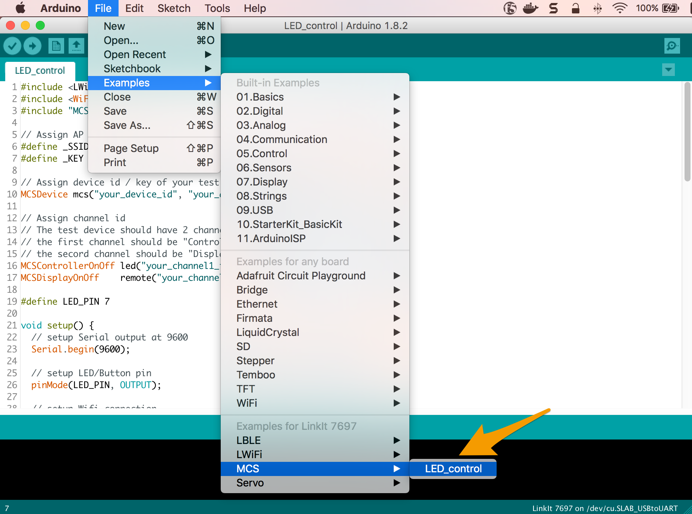
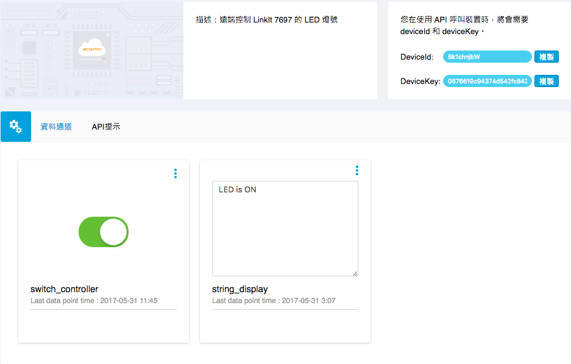

# Arduino 範例
## 遠端控制 LED 明滅

我們將使用 LinkIt 7697 Arduino 與 MCS Lite 伺服器溝通。利用 MCS Lite 開關型別的資料通道控制 LinkIt 7697 開發板上 USR LED 燈號的明滅，並且回傳 USR LED 當前的狀態到另一個資料通道上。

在此，我們提供了兩種實作方式，第一個是透過 MCS 函式庫，透過叫用已經封裝好的函示來快速的完成與 MCS Lite 服務器的連線與操作。

若您想要更深入的了解 MCS Lite 底層的設計與通訊協定，您也可以參考第二種方法，從無到有，實作與 MCS Lite 的 WebSocket 與 RESTful APIs 連線。

### 方法一：使用 MCS 函式庫
LinkIt 7697 的 Arduino board support package 中包含了 MCS 函式庫，您可以使用這個函式庫來實作與 MCS 或 MCS Lite 伺服器之間的操作，這也是相對簡單又快速的方式。其提供的功能包括：

* 連線到指定的 MCS 或 MCS Lite 服務器。
* 建立資料通道。
* 上傳資料到 MCS 或 MCS Lite 服務器。
* 從 MCS 或 MCS Lite 服務器接收資料。

其中針對 MCS Lite 可透過 **MCSLiteDevice** 類別來建構連線資訊。

```cpp
MCSLiteDevice(const String& device_id, const String& device_key, const String& server, int port);
```

* **device_id**: 在 MCS Lite 上建立的測試裝置的 ID
* **device_key**: 在 MCS Lite 上建立的測試裝置的 Key
* **server**: MCS Lite 所運行的伺服器的網路位址，可以是 IP 或是主機名稱
* **port**: MCS Lite 服務中，RESTful API 所使用的連接埠，預設是 3000

有關 MCS 函式庫更詳細的介紹請參考 [Labs 官方文件](https://docs.labs.mediatek.com/resource/linkit7697-arduino/en/using-mcs-library)。


現在我們就用 MCS 函式庫的範例讓您的 LinkIt 7697 連上 MCS Lite，並且可以在 MCS Lite 網頁介面上控制 LinkIt 7697 的 LED 燈。

#### 前置作業

1. 設定 LinkIt 7697 的 Arduino IDE 開發環境，詳細步驟請參考 [Labs 官方文件](https://docs.labs.mediatek.com/resource/linkit7697-arduino/en/setup-arduino-ide-for-linkit-7697)。
2. 將 LinkIt 7697 連接到您的電腦，詳細步驟請參考 [Labs 官方文件](https://docs.labs.mediatek.com/resource/linkit7697-arduino/en/connecting-linkit-7697-to-computer)。
3. 啟動 MCS Lite Application，開啟瀏覽器前往 MCS Lite 頁面，建立一個產品原型，定義資料通道並且新增一個測試裝置。本範例會使用到的資料通道為：

	* 開關控制器：資料通道 ID 為 **switch_controller**
	* 開關顯示器：資料通道 ID 為 **switch_display**

	在 MCS Lite 網頁上，您可手動建立或是直接**匯入產品原型**。[下載原型範本](https://github.com/MCS-Lite/mcs-lite-example/blob/master/LinkIt_7697/Arduino/mcs-lite-prototype-led-example.json)
	
	若您更改了資料通道 ID，請記得要更改程式碼中對應的 ID 與變數喔。

#### 使用內建的 MCS > LED_control 範例
1. 開啟 Arduino IDE，在 Tools > Board 中選取 **LinkIt 7697**。在 Tools > Port 中選取 LinkIt 7697 所連接的序列埠，此序列埠的後方會標示 **(LinkIt 7697)**。 
2. 接著選取 File > Examples > MCS > LED_control 開啟 MCS 的範例程式。

3. 根據您的網路環境與 MCS Lite 設定修改代碼中的變數。
	* 首先，修改 WiFi 連線的設定
	
	```arduino
	// Assign AP ssid/password here
	#define _SSID "your_ssid"
	#define _KEY  "your_password"
	``` 
	
	* 再將範例程式中的 **MCSDevice** 修改成 **MCSLiteDevice**，並將對應的 Device ID, Device Key 與 MCS Lite 服務器連線資訊帶入，例如
	
	```arduino
	// Assign device id/key of your test device
	// MCSDevice mcs("your_device_id", "your_device_key");
	MCSLiteDevice mcs("Drcsun...", "YGsl0go...", "192.169.1.100", 3000);
	```
	
	* 將先前在 MCS Lite 網頁上建立的資料通道 ID 帶入，例如
	
	```arduino
	// Assign data channel ID
	MCSControllerOnOff led("switch_controller");
	MCSDisplayOnOff    remote("switch_display");
	```
4. 修改完成後，在 Arduino IDE 上點擊 **Upload** 按鈕，編譯並將代碼上傳到 LinkIt 7697 開發板上。
4. 上傳完成後，將畫面切換到 MCS Lite 的測試裝置詳情頁面。在 MCS Lite 頁面上操作開關類型的控制器，當開關切換至**開啟**狀態時， LinkIt 7697 開發板上的 **USR LED** 燈號會亮起，並且上傳開啟狀態（布林值 1）到開關類型的顯示器；反之，LED 燈號將熄滅，並且上傳關閉的狀態（布林值 0）。

	**MCS Lite 測試裝置操作頁面** 
	
	**LinkIt 7697 USR LED 燈號** 
	
	
### 方法二：自行實作與 MCS Lite 的 WebSocket 和 RESTful APIs 的連線
相較於**方法一：使用 MCS 函式庫**，方法二相對較為複雜，且必須自行解析所接收到的資料，因此在有提供 MCS 函式庫的開發板（如 LinkIt 7697）上進行 MCS 或 MCS Lite 相關的開發時，仍建議直接使用 MCS 函式庫。此範例可作為在不提供 MCS 函式庫的裝置上開發時的參考。

#### 前置作業

1. 設定 LinkIt 7697 的 Arduino IDE 開發環境，詳細步驟請參考 [Labs 官方文件](https://docs.labs.mediatek.com/resource/linkit7697-arduino/en/setup-arduino-ide-for-linkit-7697)。
2. 將 LinkIt 7697 連接到您的電腦，詳細步驟請參考 [Labs 官方文件](https://docs.labs.mediatek.com/resource/linkit7697-arduino/en/connecting-linkit-7697-to-computer)。
3. 啟動 MCS Lite Application 後，開啟瀏覽器前往 MCS Lite 頁面，建立一個產品原型，定義資料通道並且新增一個測試裝置。本範例會使用到的資料通道為：

	* 開關控制器：資料通道 ID 為 **switch_controller**
	* 字串顯示器：資料通道 ID 為 **string_display**

	在 MCS Lite 網頁上，您可手動建立或是直接**匯入產品原型**。[下載原型範本](https://github.com/MCS-Lite/mcs-lite-example/blob/master/LinkIt_7697/Arduino/mcs-lite-prototype-led-example.json)
	
	若您更改了資料通道 ID，請記得要更改程式碼中對應的 ID 與變數喔。

#### 使用 LED Blink 範例

1. 開啟 Arduino IDE，在 Tools > Board 中選取 **LinkIt 7697**。在 Tools > Port 中選取 LinkIt 7697 所連接的序列埠，此序列埠的後方會標示 **(LinkIt 7697)**。 
2. 將 [LED Blink Example](https://github.com/MCS-Lite/mcs-lite-example/blob/master/LinkIt_7697/Arduino/LED_controller.ino) 的程式碼複製貼上於 Arduino IDE 編輯器中，並根據您的網路環境與 MCS Lite 設定修改代碼中的變數，例如

	```arduino
	char ssid[] = "mcs";  
	char pass[] = "mcs123";  
	char deviceId[] = "HydTsgYie";  
	char deviceKey[] = 	"96e2478320088f10242360c768fce82faf119fd38524afc8c461e5da9b20300c";  
	char server[] = "192.168.1.241";  
	int ws_port = 8000;  
	int rs_port = 3000
	```
	
	* **ssid**: 所要連接的無線網路識別名稱
	* **pass**: 所要連接的無線網路密碼
	* **device ID**: 在 MCS Lite 上建立的測試裝置的 ID
	* **device Key**: 在 MCS Lite 上建立的測試裝置的 Key
	* **server**: MCS Lite 所運行的伺服器的網路位址，可以是 IP 或是主機名稱
	* **ws_port**: MCS Lite 服務中，WebSocket 所使用的連接埠，預設是 8000
	* **rs_port**: MCS Lite 服務中，RESTful API 所使用的連接埠，預設是 3000

3. 在 Arduino IDE 上點擊 **Upload** 按鈕，將修改後的代碼上傳到 LinkIt 7697 開發板上。
	
4. 上傳完成後，將畫面切換到 MCS Lite 的測試裝置詳情頁面。在 MCS Lite 頁面上操作開關類型的控制器，當開關切換至開啟狀態時， LinkIt 7697 開發板上的 **USR LED** 燈號會亮起，並且上傳 **LED is ON** 字串到字串類型的顯示器；反之，LED 燈號將熄滅，並且上傳 **LED is OFF** 的字串。

	**MCS Lite 測試裝置操作頁面** 	
	**LinkIt 7697 USR LED 燈號** 

#### 代碼解說
在這個範例中，我們首先與 MCS Lite 伺服器建立起了 WebSocket 連線，用來接收來自伺服器端所發送的指令。WebSocket 的連線是永久性的，一但建立之後，會定期發送 heartbeat 通知伺服器此裝置依然存活，保持連線。

**在 setup() 中呼叫 connectWs() 建立 WebSocket 連線**

```arduino
void setup() {
	...
	// 組 WebSocket 的請求封包
  	request += "GET /deviceId/";
	...
  	request += "\r\nOrigin: null\r\n\r\n";
  	// 呼叫 WebSocket 連線函式
  	connectWs();
}
void connectWs () {
	if (ws_client.connect(server, ws_port)) {
		Serial.println("connected to ws_server");
		...
       }
}
```

**在 loop() 中對 MCS Lite 伺服器發送 WebSocket heartbeat，並且接收來自伺服器端的指令/資料**

```arduino
void loop() {
	...
	//當 WebSocket 連線建立時，每 10 秒送出 heartbeat 封包
  	while (ws_client.available()) {
     	if(lastTime == 0) {
        	lastTime = millis();
      	} else {
        	int thisTime = millis();
        	if(thisTime - lastTime > 10 * 1000) {
          	unsigned char frame;
          	frame = 0x01; // FIN
          	frame = (0x01 << 4);
          	ws_client.print(frame);
          	lastTime = millis();
       	 }
      }
     
      //讀取 MCS Lite 伺服器送出的指令/資料
      int v = ws_client.read();
     
      if (v != -1) {
        	wscmd += (char)v;  
        	//透過字串比對的方式，當收到的字串與先前定義的 switch_on 字串相同時，開啟 USR LED，其中 USR LED 是對應到 LinkIt 7697 的 P7 角位
        	if (wscmd.substring(2).equals(switch_on)){
          	digitalWrite(7, HIGH);
          	String data = "string_display,,LED is ON";
          	upload_datapoint(data);
          	wscmd = "";
          //透過字串比對的方式，當收到的字串與先前定義的 switch_off 字串相同時，關閉 USR LED，其中 USR LED 是對應到 LinkIt 7697 的 P7 角位
        	} else if (wscmd.substring(2).equals(switch_off)){
          	digitalWrite(7, LOW);
          	String data = "string_display,,LED is OFF";
          	upload_datapoint(data);
          	wscmd = "";
        		}
      	}
  	}
	...
}
```
在上述的範例中，我們簡單採取字串比對的方式，來判別開與關的指令，您可以進一步透過 JSON parser 來處理所接收到的 JSON 格式的指令/資料。

同時，您可能也會發現到，在接收處理 WebSocket 的資料時，我們同時也呼叫了 **upload_datapoint()** 函式，透過 RESTful API 上傳一個字串到 MCS Lite 伺服器。其中 **string_display** 為我們先前所定義的資料通道 ID。

```arduino
if (wscmd.substring(2).equals(switch_on)){
	digitalWrite(7, HIGH);
	String data = "string_display,,LED is ON";
   	upload_datapoint(data);
	wscmd = "";
} else if (wscmd.substring(2).equals(switch_off)){
	digitalWrite(7, LOW);
   	String data = "string_display,,LED is OFF";
   	upload_datapoint(data);
	wscmd = "";
}
```

```arduino
void upload_datapoint(String content) {
	if (rs_client.connect(server, rs_port)) {
    	Serial.println("rs_client is built.");
    	int thislength = content.length();
    	rs_client.print("POST /api/devices/");
    	...
    	rs_client.println(); 
   		while(!rs_client.available())
    	{
      		delay(10);
    	}
  	}
  	Serial.println("rs_client is closed.");
  	rs_client.stop();
}
```
