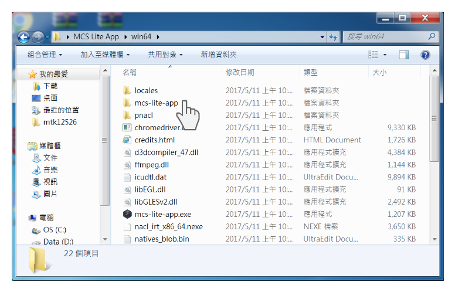
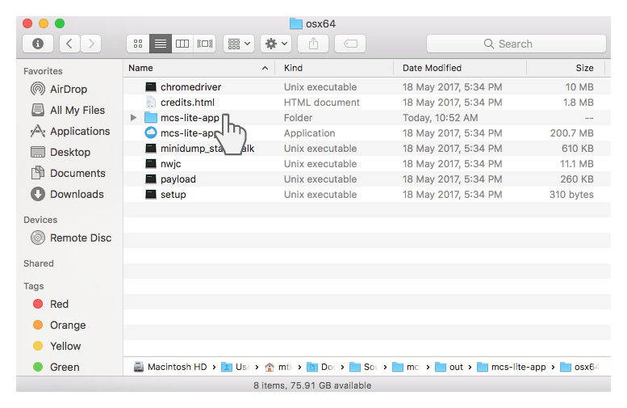

## 系統管理主控台使用說明

請注意，由於目前 Beta 版尚未有系統管理主控台圖形化介面，因此必須直接在 mcs-lite-app 資料夾下更改相關參數。

#### Windows 作業系統

#### Mac OSX 作業系統

在 **mcs-lite-app/config** 資料夾下，會有系統與連線相關的設定檔案，其檔案格式接為 JSON。

#### 設定檔說明

| 檔案名稱 | 修改說明 |
| :--- | :--- |
| db.json | 此為 nedb 連線相關設定，一般情況皆維持預設即可。 |
| oauth.json | 此為 OAuth service 相關設定。在尚無 Auto Scaling 與 Distributed Deployment 的需求之前，OAuth service 的 host 與 port（預設為 3000）設定，與 RESTful service 相同即可。另外注意，如果為 production 環境，建議 JWT\_SECRET 不要使用預設的"superSecret"。 |
| rest.json | 此為 RESTful service 相關設定。設定 MCS Lite API 所要連線的 host 與 port，如果有更改請務必通知使用者。另外注意，如果為 production 環境, secretKey, prototypeKey, deviceKey, session 請務必改成另外的內容。 |
| stream.json | 此為 streaming service 的參數設定。 |
| wot.json | 此為 WebSocket 的參數設定。 |

更新上述的檔案之後，請務必重新啟動 mcs-lite-app 以載入最新的設定。

### 如何備份 DB ?

目前產品原型 \(prototype\)，測試裝置 \(test device\)，資料通道 \(data channel\)，上傳資料 \(datapoint\) 與使用者帳戶 \(user account\) 等資料，都是以 JSON 格式儲存在 **mcs-lite-app/db **資料夾下，備份 db 即是把這個資料夾的檔案備份好即可。
