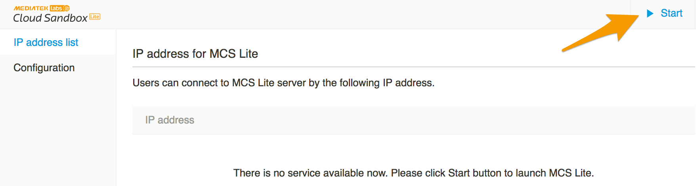

## 系統管理主控台使用說明
### 基本設定

系統管理主控台是一個網頁介面，當您啟動 MCS Lite 應用程式同時會看到管理主控台介面，其主要目的是為了方便您自行維護 MCS Lite 的系統設定，省去手動修改設定檔的時間。在第一次使用 MCS Lite 時，必須先註冊一個管理者帳號，之後皆必須透過此管理者帳號登入主控台，啟動服務或修改相關設定。

若您沒有看到註冊畫面，請直接在瀏覽器輸入 **http://localhost:3002/admin/signup**，手動開啟註冊頁面，完成註冊。

系統管理主控台提供有下面幾個功能：

1. 開關服務：啟動與停止 MCS Lite 物聯網平台，當服務停止時，網路上的裝置則無法連線到 MCS Lite。
2. 連線介面列表：也就是 MCS Lite 所運行的電腦的網路位址 (IP) 以及 MCS Lite 服務所綁定的連接埠 (port)，在同個網路內的使用者與裝置則可連線到 IP:port 來使用 MCS Lite 服務。當 MCS Lite 所運行的電腦有不只一張網路卡或是連接上不只一個網路時，您將會看到這些網路位址 (IP) 一一的被列出。
3. 系統管理：修改資料庫 (database)，使用者身份驗證 (OAuth)，網路應用接口 (web APIs) 的服務設定，以下為系統設定檔的詳細說明，在一般的環境下，建議使用預設值，無須特意更改。

| 檔案名稱 | 說明 |
| :--- | :--- |
| db.json | 此為 nedb 連線相關設定，一般情況皆維持預設即可。 |
| oauth.json | 此為 OAuth service 相關設定。在尚無 auto scaling 與 distributed deployment 的需求之前，OAuth service 的 host 與 port（預設 port 為 3000）設定，與 RESTful service 相同即可。另外注意，如果為 production 環境，建議 JWT\_SECRET 不要使用預設的 "superSecret"。 |
| rest.json | 此為 RESTful service 相關設定。設定 MCS Lite API 所要連線的 host 與 port（預設 port 為 3000），如果有更改請務必通知使用者。另外注意，如果為 production 環境, secretKey, prototypeKey, deviceKey, session 請務必改成另外的內容。 |
| stream.json | 此為 streaming service 的參數設定。 |
| wot.json | 此為 WebSocket 的所要連線的 host 與 port（預設 port 為 8000） |

更新上述的檔案之後，請務必重新啟動 MCS Lite 服務以載入最新的設定。

### 資料庫管理
#### NeDB

除了系統設定，資料的維護也是管理者關注的功能之一，MCS Lite 預設採用的 NeDB 是一個輕量的 JavaScript 資料庫，所有的資料是以 JSON 檔案的格式儲存，不需額外安裝任何資料庫軟體。新版同時支援 MySQL 資料庫，詳細操作步驟請看下節介紹。

預設的 NeDB 檔案位於 **mcs-lite-app/db** 資料夾下。

| 檔案名稱 | 說明 |
| :--- | :--- |
|datachannels.json|儲存所建立的資料通道。當通道被刪除時，資料依然保存，但 isActive 變成 false|
|datapoints.json|儲存所上傳的資料點。|
|devices.json|儲存所建立的測試裝置。當裝置被刪除時，資料依然保存，但 isActive 變成 false|
|prototypes.json|儲存所建立的產品原型。當原型被刪除時，資料依然保存，但 isActive 變成 false|
|unittypes.json|數值型態的資料通道所要使用的“單位”。系統預設已有 53 個最常用的單位，您也可以在創建資料通道時，自行建立新的度量單位。|
|users.json|儲存系統上所有的使用者資訊。|

更新上述的資料庫檔案之後，請務必重新啟動 MCS Lite 服務以載入最新的資料。

由於目前產品原型 (Prototype)，測試裝置 (Test Device)，資料通道 (Data Channel)，上傳資料 (Data Channel) 與使用者帳戶 (User Account) 等資料，都是以 JSON 格式儲存在 **mcs-lite-app/db** 資料夾下，若要進行資料備份只要把這個資料夾的檔案備份好即可。

#### MySQL

MCS Lite 另外支援使用 MySQL 資料庫來存取資料。

如果您已經使用 MySQL 作為主要的資料庫，並希望將 MCS Lite 的資料也整合到 MySQL 當中用以取代預設的 NeDB，請按照下列步驟來完成資料庫表格與數據的搬遷：

1. 請先關閉 MCS Lite 應用程式。
2. 更改 configs/db.json 中的資料庫設定。請參考欄位說明與範例：
	* db: 資料庫類型，這裡使用的是 MySQL，不需更改。
	* host: MCS Lite 連線的資料庫的主機名稱或 IP 位址。
	* port: MCS Lite 連線的資料庫的連接埠。
	* username: MCS Lite 連線的資料庫的帳號。
	* password: MCS Lite 連線的資料庫的密碼。
	* database: 您為 MCS Lite 建立的資料庫名稱。
	* dialect: 資料庫類型，這裡使用的是 MySQL，不需更改。

	```  
	{
		"db": "mysql",
   		"host": "127.0.0.1",
   		"port": 3306,
   		"username": "root",
   		"password": "1234",
   		"database": "mcslite",
   		"dialect": "mysql",
   		"logging": true
	}
	```
	
3. 完成上個步驟後，請在 MCS Lite 應用程式所在的目錄下，使用命令提式視窗透過 Node.js 執行 migration.js 腳本，在指定的 MySQL 資料庫中建立對應的表格，欄位與數據。看到 *Migration success* 提示即表示數據搬遷完成。
	
	```
	$ node ./mcs-lite-app/migration.js 
	```
	```
	Migration start...
	******
	Migration success.
	```
4. 此時，您已經可以開啟 MCS Lite 應用程式，使用其完整的功能。並可以在 MySQL 資料庫中看到先前已經存入 NeDB 的與之後產生的數據。

如果您在操作的過程中遇到任何問題，可以先使用原有的 SQL client 連線到 MCS Lite MySQL 資料庫，確保連線以及數據的正確性。

### 使用者管理
使用者管理提供了在主控台上新增，修改，刪除與查詢 MCS Lite 使用者的功能。您可以單筆或是透過匯入 CSV 檔案的方式批次新增使用者，但若您的 CSV 檔案中有格式錯誤或是重複的使用者等問題，則會造成整筆資料匯入失敗，請詳細檢查您的使用者匯入清單。使用者匯入清單的格式如下：

```
暱稱,信箱帳號,密碼
```
例如

```
a123,a123@abc.com,11111111
a124,a124@abc.com,11111111
a125,a125@abc.com,11111111
a126,a126@abc.com,11111111
a127,a127@abc.com,11111111
```
備註：若發現管理主控台的資料與物聯網平台不一致時，請重新啟動整個 MCS Lite 應用程式，此乃 NeDB 中的資料在多個程式間會無法即時同步的問題。若您使用的為 MySQL 資料庫，則不會有此問題。

### 資料管理
資料管理讓管理者可以在主控台上刪除所有使用者新增的數據。資料庫中的資料會完全被刪除，除了預設的資料通道單位與管理者帳號。

備註：若發現管理主控台的資料與物聯網平台不一致時，請重新啟動整個 MCS Lite 應用程式，此乃 NeDB 中的資料在多個程式間會無法即時同步的問題。若您使用的為 MySQL 資料庫，則不會有此問題

### 關閉 MCS Lite 應用程式
MCS Lite 應用程式可分為兩個部分，物聯網平台與管理主控台。

物聯網平台主要是讓使用者能透過網頁介面建立產品原型，操作裝置並視覺化數據，可透過在管理主控台上的開關開啟與關閉。


管理主控台則是讓管理者可以管理使用者數據與物聯網平台的設定。當您從系統常駐圖示的選單中關閉 MCS Lite 時，整個 MCS Lite 應用程式都會被關閉，包括物聯網平台服務。

