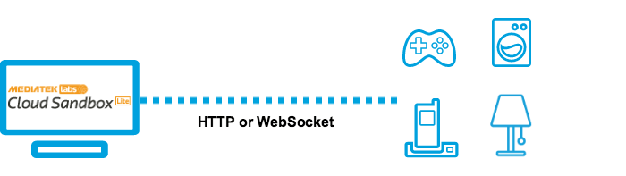

# 物聯網平台使用說明

如果您先前已經使用過 MediaTek Cloud Sandbox (MCS) 服務，您應該會對 MCS Lite 的操作介面相當熟悉。您只需要在瀏覽器的網址列上輸入 MCS Lite 所綁定的 IP 位址與連接埠即可連上本地端的 MCS Lite 服務平台。有關 MCS Lite 在您本地端的連線資訊，請洽您的系統管理員。

MCS Lite 與 MCS 相同，能讓使用者透過網頁介面先行定義自己的產品原型與管理測試裝置，接著實體裝置便可呼叫 MCS Lite 提供的 web APIs 開始上傳與接收資料。如果您之前未曾使用過 MCS 服務，可先透過以下幾個重要的名詞介紹來了解如何在 MCS Lite 上建立測試裝置，接收資料並實現遠端遙控。

## 產品原型

### 何謂產品原型？

產品原型（prototype）是您在開發時設計的產品藍圖。主要定義了

#### **資料通道（Data Channel）**

資料通道是用來定義裝置與 MCS Lite 之間傳遞的數據的型態，讓 MCS Lite 能正確地分辨與儲存這些數據，並產生對應的歷史圖表。資料通道有以下兩種類型：

* **顯示器（Display）**：由裝置的感應元件蒐集而回傳到 MCS Lite 並顯示在 MCS Lite 頁面上的數據。

* **控制器（Controller）**：透過 MCS Lite 傳送給裝置的指令或數據。

為了能顯示及處理不同類型的數據，MCS Lite 提供以下幾種資料型態的通道：

* **布林開關（Boolean）：**用布林值來顯示/操作裝置的開機與關機兩種狀態。

* **整數（Integer）**：用來顯示/設定任意的整數，例如顯示使用者一天走了多少步數。

* **浮點數（Float）**：用來顯示/設定任意的浮點數，例如設定空調設備的溫度。

* **字串（String）**：用來顯示/設定任意的字串，例如顯示裝置當前韌體版本或時間。

* **十六進位數（Hex）**：用來顯示/設定任意的十六進位數值，例如設定 LED 燈的顯示顏色。

* **GPIO **：用來顯示/設定 GPIO 的數位訊號。例如設定 Pin 4 角位為 High。

* **PWM **：用來顯示/設定傳遞到 GPIO 的 PWM 數位訊號, 例如在 Pin 3 位置的 level 15 訊號。

### 如何建立產品原型？

在**開發** > **原型**頁面，點擊**創建**按鈕後，您可透過以下三種方法來建立您的產品原型：

* 自行設定
  1. 點擊畫面上方的**開發**連結，並選擇**產品原型**。
  2. 點擊**創建**按鈕，在**選擇創建方式**欄位中保持預設的**輸入原型資訊**。
  3. 輸入產品原型名稱與版本後點擊**儲存**按鈕。您的產品原型已建立。
* 匯入 JSON 檔  
  1. 點擊畫面上方的**開發**連結，並選擇**產品原型**。  
  2. 點擊**創建**按鈕，在**選擇創建方式**欄位中選擇**匯入 JSON 檔。**  
  3. 您可貼上或是**瀏覽上傳** JSON 檔案。點擊**儲存**按鈕，您的產品原型已建立。  
  4. 如何取得/匯出產品原型 JSON 檔案，請參考 [如何建立您的第一個產品原型](https://mcs.mediatek.com/resources/zh-TW/latest/tutorial/getting_started#建立您的第一個產品原型)

* 使用範例原型  
  1. 點擊畫面上方的**開發**連結，並選擇**產品原型。**  
  2. 點擊**創建**按鈕，在**選擇創建方式**欄位中選擇**使用範例原型**。  
  3. 此時，**選擇範例**的下拉選單中會出現由管理者預先建立好的範例原型，選擇一個您所要的範例。  
  4. 您可以更改範例原型的基本資料，或維持原樣直接儲存建立。

當產品原型建立後，點擊您剛建立的**詳情**按鈕則可以開始建立資料通道並且新增測試裝置了。

## 測試裝置

### 何謂測試裝置？

如果說產品原型（prototype）是您開發與設計產品的藍圖，測試裝置 (test device) 則是對應到一個個實體的設備。

您已完成建立產品原型與設定資料通道，然而，在開始收集數據或操作實體設備之前，您必須在產品原型下建立對應的測試裝置，每一個測試裝置都會有一組 **DeviceId** 和 **DeviceKey**，當您要將實體設備產生的數據回傳到 MCS Lite 時，則可透過在回傳訊息中指定裝置的 ID 與 key 將資料儲存到對應的測試裝置中。

您可以在 產品原型**詳情頁面 > 測試裝置**底下，查看此原型底下所有的測試裝置，或選取特定測試裝置來觀看其收集的數據或進行遠端操控。您亦可以修改或查看關於這個裝置的詳細資訊。

### 如何建立測試裝置？

#### 在 MCS Lite 上建立測試裝置

1. 點選產品原型的**詳情**按鈕。
2. 點選畫面右上方的**創建測試裝置**按鈕。
3. 在創建測試裝置對話窗中，輸入測試裝置名稱和描述，然後點擊**確定**按鈕。
4. 在創建成功的訊息對話窗中，您可以直接點擊**詳細資料**按鈕進入測試裝置頁面，或在產品原型詳情頁面中的測試裝置分頁內查看屬於此產品原型的測試裝置。

#### 設定實體裝置與 MCS Lite 的連線

目前 MCS Lite 主要支援 WebSocket 與 HTTP 兩種通訊協定，提供對應的 web APIs 讓實體裝置與 MCS Lite 物聯網平台連線，上傳並接收數據與指令。

更多有關使用 WebSocket 與 HTTP 上傳接收數據的詳係說明，請前往 **API 參考文件**。

## 原型範例

### 何謂原型範例？

**系統管理者**可將自己建立的產品原型分享給所有使用者，讓使用者可以簡單的複製並修改來產生自己的原型。這樣的功能很適合應用在教學案例當中，老師可以先建立並分享範例原型給學生。或者是在開發團隊中，預先定義好產品的原型，讓開發者可以直接套用進行各別功能的開發。

### 如何建立原型範例？

只有**系統管理者**能擁有這個權限，當管理者使用自己的帳號密碼登入 MCS Lite 物聯網服務平台並建立一個產品原型後，可在產品原型的功能選單中看到**設為範本**選項。設定為範本的原型會出現有**原型範例**的標示。

### 如何複製原型範例？

當一個產品原型被設定為範例後，此系統所有的使用者皆可瀏覽並複製此原型。使用者可透過以下兩個方式複製原型範例：

1. 在**儀表板**頁面 &gt; **原型範例**區塊 &gt; **與我分享的範例** &gt; 點擊原型名稱，可瀏覽原型的資料通道，或直接點擊**使用範例創建原型**，複製建立您的原型。
2. 在**原型列表**頁面 &gt; 點擊**創建**按鈕 &gt; 在**選擇創建方式**欄位中選擇 **使用範例原型** &gt; 在**選擇範例**的下拉選單中選擇一個您所要的範例，複製建立您的原型。

請注意，當原型範例被複製後，新的原型並不會與原型範例連動，因此，管理者若更改了原型範例，此更動並不會套用在已經建立的原型上。