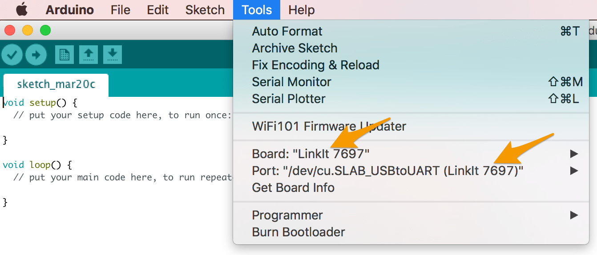
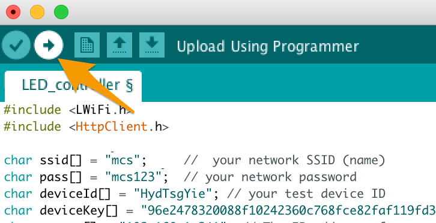
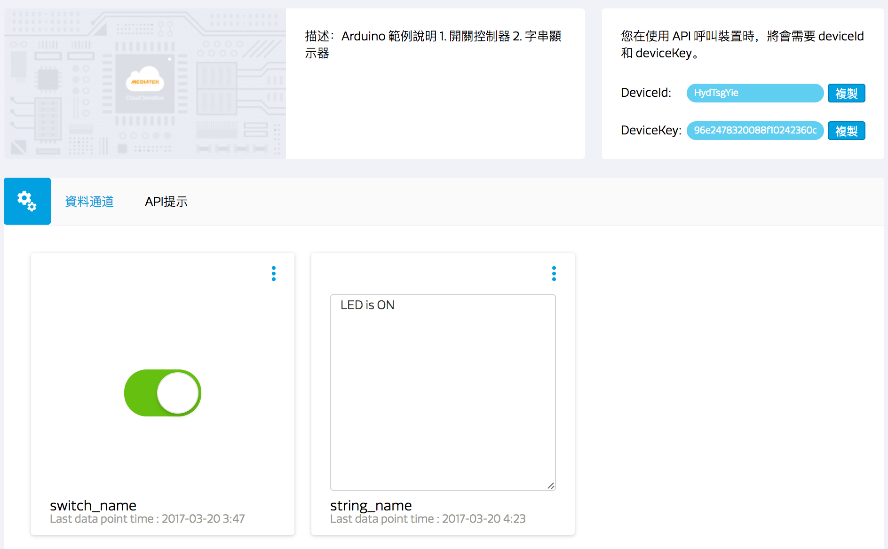
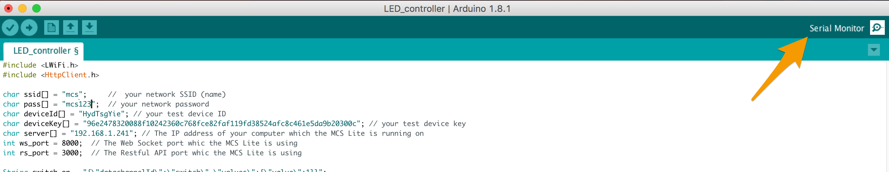
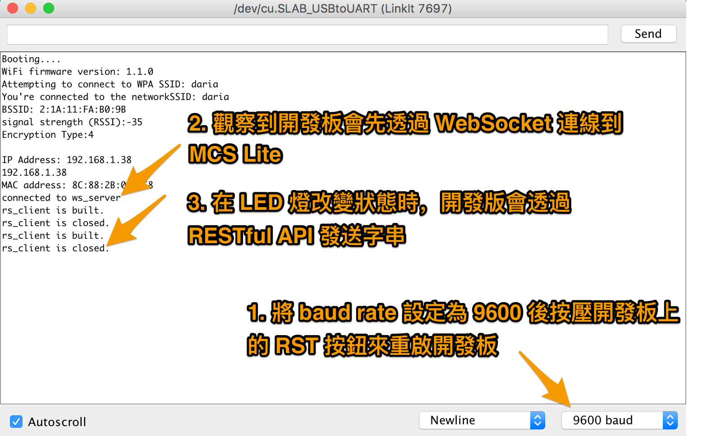

# Arduino 範例
## 遠端控制 LED 明滅

在這個範例當中，我們將介紹如何透過 WebScoket 與 RESTful API 與 MCS Lite 伺服器溝通。利用 MCS Lite 開關型別的資料通道控制 LinkIt 7697 開發板上 USR LED 燈號的明滅，並且回傳 USR LED 當前的狀態到字串型別的資料通道上。

### 前置作業

1. 設定 LinkIt 7697 的 Arduino IDE 開發環境，詳細步驟請參考 [Labs 官方文件](https://labs.mediatek.com/zh-tw/support/resources)。
2. 將 LinkIt 7697 連接到您的電腦，詳細步驟請參考 [Labs 官方文件](https://labs.mediatek.com/zh-tw/support/resources)。
3. 啟動 MCS Lite Application，建立一個產品原型，定義資料通道並且新增一個測試裝置。本範例會使用到的資料通道為：

	* 開關控制器：資料通道 ID 為 **switch**
	* 字串顯示器：資料通道 ID 為 **string**

	您也可以自行命名所建立的資料通道 ID ，若資料通道 ID 有變動，請記得要更改程式碼中對應的 ID 與變數喔。

### 動手實作

1. 開啓 Arduino IDE，在 Tools > Board 中選取 **LinkIt 7697**。在 Tools > Port 中選取 LinkIt 7697 所連接的序列埠，此序列埠的後方會標示 **(LinkIt 7697)**。 
2. 將 [LED Blink Example](https://github.com/Mediatek-Cloud/mcs-lite-example/blob/master/Arduino/LED_controller/LED_controller.ino) 的程式碼複製貼上於 Arduino IDE 編輯器中，並根據您的網路環境與 MCS Lite 設定修改代碼中的變數：

	```
char ssid[] = "mcs";  
char pass[] = "mcs123";  
char deviceId[] = "HydTsgYie";  
char deviceKey[] = "96e2478320088f10242360c768fce82faf119fd38524afc8c461e5da9b20300c";  
char server[] = "192.168.1.241";  
int ws_port = 8000;  
int rs_port = 3000; 
	```

	* ssid: 所要連接的無線網路識別名稱
	* pass: 所要連接的無線網路密碼
	* device ID: 在 MCS Lite 上建立的測試裝置的 ID
	* device Key: 在 MCS Lite 上建立的測試裝置的 Key
	* server: MCS Lite 所運行的伺服器的網路位址，可以是 IP 或是主機名稱
	* ws_port: MCS Lite 服務中，WebSocket 所使用的連接埠，預設是 8000
	* rs_port: MCS Lite 服務中，RESTful API 所使用的連接埠，預設是 3000

3. 在 Arduino IDE 上點擊 Upload 按鈕，將修改後的代碼上傳到 LinkIt 7697 開發板上。
4. 上傳完成後，將畫面切換到 Arduino IDE 的 Serial Monitor 與 MCS Lite 的測試裝置詳情頁面。在 MCS Lite 頁面上操作開關類型的控制器，當開關切換至**開啟**狀態時， LinkIt 7697 開發板上的 **USR LED** 燈號會亮起，並且上傳 **LED is ON** 字串到字串類型的顯示器；反之，LED 燈號將熄滅，並且上傳 **LED is OFF** 的字串。

	**MCS Lite 測試裝置操作頁面** 
	
	**LinkIt 7697 USR LED 燈號** 
	
	**開啟 Arduino IDE 的 Serial Monitor 頁面**  
	
	**輸出在 Serial Monitor 上的訊息** 
	
	
### 代碼解說
在這個範例中，我們首先與 MCS Lite 伺服器建立起了 WebSocket 連線，用來接收來自伺服器端所發送的指令。WebSocket 的連線是永久性的，一但建立之後，會定期發送 heartbeat 通知伺服器此裝置依然存活，保持連線。

**在 setup() 中呼叫 connectWs() 建立 WebSocket 連線**

```
void setup() {
	...
	// 組 WebSocket 的請求封包
  	request += "GET /deviceId/";
	...
  	request += "\r\nOrigin: null\r\n\r\n";
  	// 呼叫 WebSocket 連線函式
  	connectWs();
}
void connectWs () {
	if (ws_client.connect(server, ws_port)) {
		Serial.println("connected to ws_server");
		...
       }
}
```

**在 loop() 中對 MCS Lite 伺服器發送 WebSocket heartbeat，並且接收來自伺服器端的指令/資料**

```
void loop() {
	...
	//當 WebSocket 連線建立時，每 10 秒送出 heartbeat 封包
  	while (ws_client.available()) {
     	if(lastTime == 0) {
        	lastTime = millis();
      	} else {
        	int thisTime = millis();
        	if(thisTime - lastTime > 10 * 1000) {
          	unsigned char frame;
          	frame = 0x01; // FIN
          	frame = (0x01 << 4);
          	ws_client.print(frame);
          	lastTime = millis();
       	 }
      }
     
      //讀取 MCS Lite 伺服器送出的指令/資料
      int v = ws_client.read();
     
      if (v != -1) {
        	wscmd += (char)v;  
        	//透過字串比對的方式，當收到的字串與先前定義的 switch_on 字串相同時，開啟 USR LED，其中 USR LED 是對應到 LinkIt 7697 的 P7 角位
        	if (wscmd.substring(2).equals(switch_on)){
          	digitalWrite(7, HIGH);
          	String data = "string,,LED is ON";
          	upload_datapoint(data);
          	wscmd = "";
          //透過字串比對的方式，當收到的字串與先前定義的 switch_off 字串相同時，關閉 USR LED，其中 USR LED 是對應到 LinkIt 7697 的 P7 角位
        	} else if (wscmd.substring(2).equals(switch_off)){
          	digitalWrite(7, LOW);
          	String data = "string,,LED is OFF";
          	upload_datapoint(data);
          	wscmd = "";
        		}
      	}
  	}
	...
}
```
在上述的範例中，我們簡單採取字串比對的方式，來判別開與關的指令，您可以進一步透過 JSON parser 來處理所接收到的 JSON 格式的指令/資料。

同時，您可能也會發現到，在接收處理 WebSocket 的資料時，我們同時也呼叫了 **upload_datapoint()** 函式，透過 RESTful API 上傳一個字串到 MCS Lite 伺服器。其中 **string** 為我們先前所定義的資料通道 ID。

```
if (wscmd.substring(2).equals(switch_on)){
	digitalWrite(7, HIGH);
	String data = "string,,LED is ON";
   	upload_datapoint(data);
	wscmd = "";
} else if (wscmd.substring(2).equals(switch_off)){
	digitalWrite(7, LOW);
   	String data = "string,,LED is OFF";
   	upload_datapoint(data);
	wscmd = "";
}
```

```
void upload_datapoint(String content) {
	if (rs_client.connect(server, rs_port)) {
    	Serial.println("rs_client is built.");
    	int thislength = content.length();
    	rs_client.print("POST /api/devices/");
    	...
    	rs_client.println(); 
   		while(!rs_client.available())
    	{
      		delay(10);
    	}
  	}
  	Serial.println("rs_client is closed.");
  	rs_client.stop();
}
```


